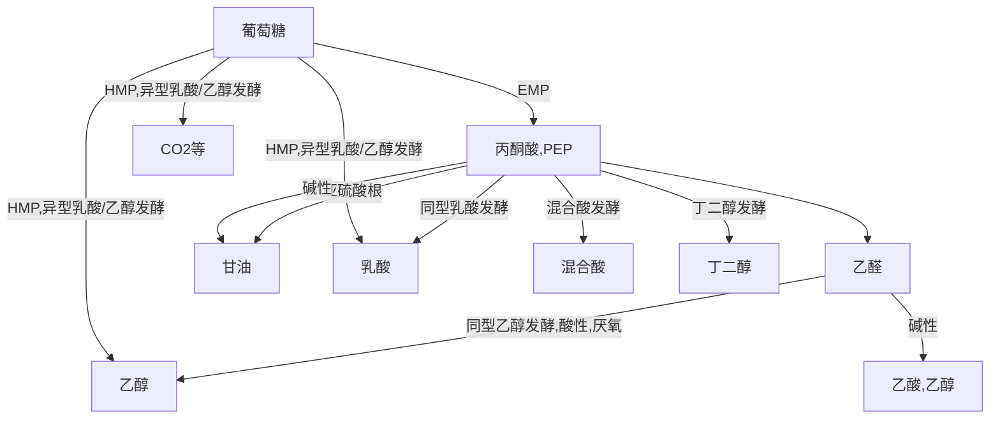

# draft

```mermaid

 graph TB;
 葡萄糖--EMP-->丙酮酸,PEP
 丙酮酸,PEP-->乙醛
 乙醛--同型乙醇发酵,酸性,厌氧-->乙醇
 丙酮酸,PEP--亚硫酸根-->甘油
 乙醛--碱性-->乙酸,乙醇
 丙酮酸,PEP--碱性-->甘油
 丙酮酸,PEP--同型乳酸发酵-->乳酸
 葡萄糖--HMP,异型乳酸/乙醇发酵-->CO2等
 葡萄糖--HMP,异型乳酸/乙醇发酵-->乳酸
 葡萄糖--HMP,异型乳酸/乙醇发酵-->乙醇
 丙酮酸,PEP--混合酸发酵-->混合酸
 丙酮酸,PEP--丁二醇发酵-->丁二醇
```
