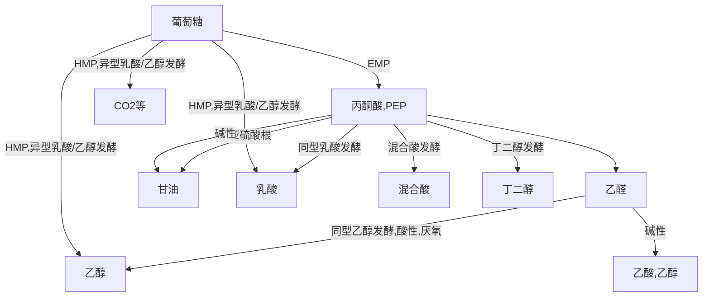

# draft

| 无性孢子 | 形态                   | 特点1                                | 特点2        |
| -------- | ---------------------- | ------------------------------------ | ------------ |
| 孢囊孢子 | 近球形                 | 内生孢子，生于孢子囊内               |              |
| 分生孢子 | 多样                   | 外生孢子，梗顶端细胞特化             | 广泛         |
| 节孢子   | 短柱状、桶装或两端钝圆 | 外生孢子，菌丝断裂从横膈膜处形成     |              |
| 厚垣孢子 | 圆形、柱形等           | 细胞膨大，原生质浓缩，细胞壁**加厚** | 抵抗不良环境 |

#### 计数

- 直接计数法：稀释$\to$血细胞计数法/膜过滤计数法，得到活菌数
- 间接计数法：得到CFU（菌落形成单位），测微量细胞
- 比浊法：测OD（光密度）值，根据标准曲线求得菌浓度

#### 重量

- 称量菌体的干重（湿重）
- 称量蛋白、叶绿素等含量

#### 生理指标

- 呼吸强度、酶活性等

