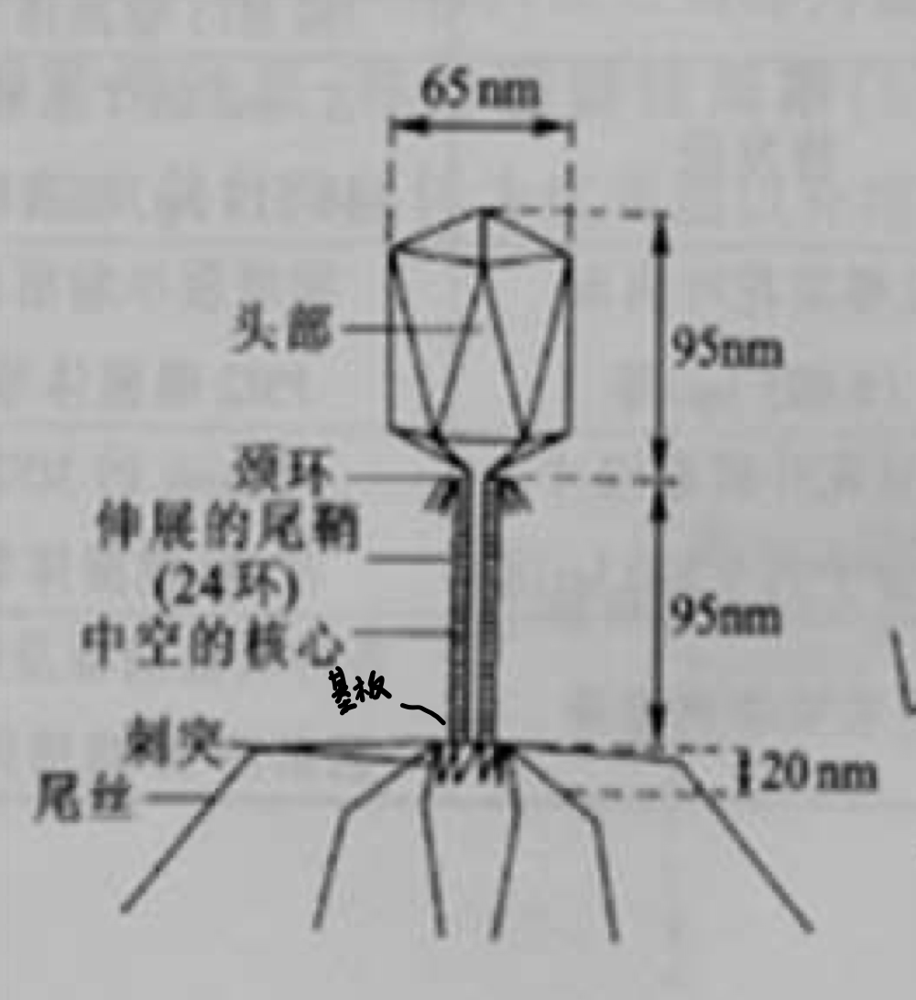
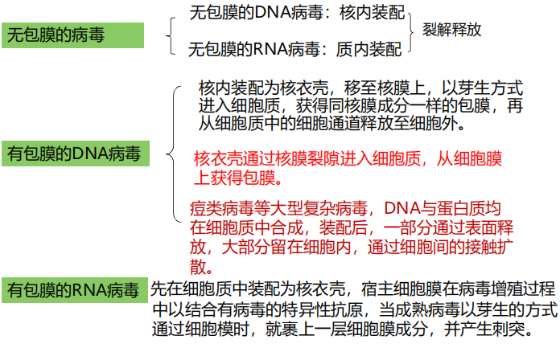
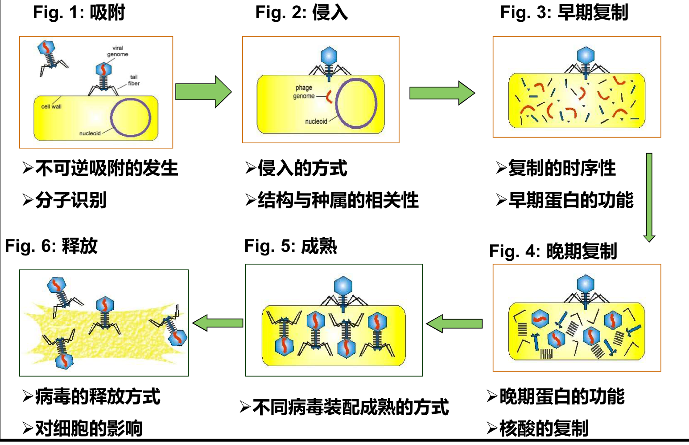

# 第七章 病毒
## 概述
### 历史（了解）
* Ivanowsky：发现烟草花叶病
* Beijerinck：定性病毒，是比细菌小的具有传染性的活的流质
* F W Twort、F d’Herelle：分别发现细菌病毒
* Hershey和Chase证实噬菌体的遗传物质仅是DNA,开创了病毒分子生物学

病毒学：研究病毒（virus）的本质及其与宿主的相互作用的科学，是微生物学的重要分支学科。

### 病毒特点和定义
#### 特点：（重点，6条）
1. **不具有细胞结构**，具有一般化学大分子的特征、生物体的基本特征。
2. **一种病毒的毒粒内只含有一种核酸**，是DNA或者RNA。
3. 大部分病毒**没有酶或酶系极不完全**，不能进行独立的代谢作用。
4. **严格的活细胞内寄生**：没有自身的核糖体，没有个体生长，也不进行二均分裂，必须依赖宿主细胞进行自身的核酸复制，形成子代。
5. **个体微小**，在电子显微镜下才能看见
6. 对大多数抗生素不敏感，对**干扰素**敏感。

#### 定义
（迄今仍无一个科学而严谨的定义）由一个或数个RNA/DNA分子构成的感染性因子，通常（但非必须）覆盖有一种或数种蛋白质构成的外壳，有些外壳还有更为复杂的膜结构。

#### 分类
* （真）病毒：至少含核酸和蛋白两种组分
* 亚病毒
	* 类病毒：只含有具备侵染性的RNA组分
	* 卫星RNA：只含有不具备侵染性的RNA组分
	* 朊病毒：只含蛋白质

#### 引起疾病的特点
* 传播性
* 病死率（各有高低）
* 持续感染
* 与肿瘤的形成有关系

### 宿主范围
定义：病毒能够感染并在其中复制的宿主种类和组织细胞种类。

病毒几乎可以感染所有的细胞生物，并具有宿主特异性

按宿主范围分类：<u>噬菌体，动物病毒，植物病毒</u>

### 病毒分类与命名
#### 分类依据
* **粒子特性**：**形态**（大小、胞膜、衣壳）、**生理生化**和物理性质（分子量、沉降系数、各种条件下稳定性等）、**基因组**（大小、核酸类型、形状、正负）、蛋白、脂类及碳水化合物含量和特性、基因组组成和复制等
* **抗原性质**：包括病毒血清学性质与其抗原的关系
* **生物学特性**：病毒天然**宿主范围**、病毒在自然状态下**传播与媒介**体关系、病毒的**地理**分布/**致病**机理/组织嗜亲性、病毒引起的**病理**和组织病理学特点

#### 分类原则
核酸类型和结构，病毒体形状和大小，病毒体形态结构，对脂溶剂敏感性

## 病毒学研究基本方法

> 二元培养体系，宿主表现的间接指标

### 分离纯化
> 分离：将疑有病毒而待分离的标本经处理后，接种于敏感的实验宿主、鸡胚或细胞培养，经过一段时间孵育后，通过检查病毒特异性病理表现或其他方法来肯定病毒的存在。

**分离的一般程序**：
* **检验**标本，用青霉素、链霉素杀**灭杂菌**
* **接种**（感染易感动物、鸡胚、细胞），孵育
* **观察**出现的病状、病变或死亡
* 血清学方法**鉴定病毒种型**

### 病毒的培养

#### 噬菌体
* 加入细菌培养物
	* 培养液：变清亮
	* 营养琼脂平板：变为残迹平板
* 感染表现
	* **噬菌斑**：噬菌斑是指在宿主细菌的菌苔上，噬菌体使菌体裂解而形成的空斑。可用于噬菌体计数和鉴定。

#### 动物病毒
* 类型
	* 动物接种
	* 鸡胚接种
	* 细胞培养
		* 原代细胞
		* 二倍体细胞
		* 传代细胞
* 感染表现（细胞）
	* **蚀斑/空斑**：若标本经过适当稀释进行接种并辅以染色处理，病毒可在培养的细胞单层上形成肉眼可见的局部病损区域，即蚀斑（plaque）或称空斑。
	* **细胞病变效应**：大多数动物病毒感染细胞引起的显微表现的改变，如细胞**聚集成团、肿大、圆缩、形成多核细胞、出现包涵体甚至裂解**等。
		* **包涵体**：感染病毒的宿主细胞内，出现在**光学显微镜下可见**的大小、形态、数量不等的小体，称为包涵体。在宿主细胞内形成包涵体，是病毒的特征，不同的病毒其形成的包涵体具有不同的形态、结构、和特性，可用于分类鉴定和临床诊断。形成部位可为细胞核、细胞质或两位置中同时存在。
		本质：大多数是病毒粒子组成的，少数是细胞对病毒的反应（蛋白质聚集体颗粒）。

#### 植物病毒
枯斑：植物病毒接种敏感植物叶片产生坏死斑。

### 病毒的纯化
* 纯化标准
	* 纯化的病毒制备物应保持其<u>感染性</u>
	* 纯化的病毒制备物的理化性质应具有<u>均一性</u>
* 纯化方法：蛋白质纯化方法，然后离心

### 测定
> 感染性测定：因感染引起宿主或细胞培养某一特异性病理反应的病毒数量。  
* 病毒的**感染单位**：能够引起宿主或宿主细胞一定特异性反应的病毒最小剂量(IU)。
* 病毒的**效价**：待测样品中所含病毒的数量，通常以单位体积(ml)病毒悬浊液的感染单位数目来表示（IU/ml）

测定方法：
* 噬斑法：每毫升病毒悬液的蚀斑形成单位数
* 中点法（ID50/TCID50）：病毒感染宿主后，引起50%宿主发生死亡或病变的最小量。

### 鉴定（了解）
   a. 根据病毒感染的宿主范围及感染表现的鉴定
   b. 病毒的理化性质鉴定
   c. 血细胞凝集性质鉴定
   d. 病毒的血清学鉴定
   e. 病毒鉴定的分子生物学方法

## 毒粒

毒粒（病毒粒子、病毒颗粒）：病毒的细胞外颗粒形式，也是病毒的感染性形式。
* 是保护病毒遗传物质免遭环境坏，并作为将遗传物质从一个宿主细胞传递给另一个宿主细胞的载体。
* 是成熟（结构完整）、具有侵染力的单个病毒。
**组成**：一团能够自主复制的遗传物质+蛋白质外壳（+包膜）

### 形态结构

#### 基本结构（了解要点）

* **核心：核酸** ，决定病毒遗传、变异和复制
* **（衣）壳（子）粒**：构成病毒粒子的**最小形态单位**。
	* 每个衣壳粒是由1-6个同种多肽分子折叠缠绕而成的蛋白质亚单位。病毒粒子上不同部分的衣壳粒可同上不同的多肽分子组成。
* **衣壳**：衣壳又名壳体，由衣壳粒以对称的形式，**有规律地排列**成杆状、球状、廿面体或其他形状，构成病毒的外壳。
	* 衣壳的中心包含着病毒核酸，即核髓。有人也称衣壳为蛋白外鞘或蛋白质外壳。
	* 作用：保护、介导（传染）、抗原性。
* **核衣壳**：它是病毒蛋白质衣壳和病毒核酸的合称，又称核壳体。
* 包膜子粒：组成包膜的单位。
* **囊膜/包膜**：有些病毒除核衣壳外，在其外层还包裹着一层构造比较复杂的包膜即为囊膜，亦称被膜、外膜或封套。
	* 它由脂类和多糖组成。这种结构具有高度的**稳定性**，可保护病毒核酸不致在细胞外环境中受到破坏。无囊膜病毒的核衣壳呈裸露状态。
	* 作用：保护、介导、抗原性。
* **刺突**：有些病毒粒子表面，尤其是在 <u>有囊膜 </u> 的病毒粒子表面具有突起物，称刺突，也称囊膜突起。刺突的抗原性较强。

#### 壳体结构
有三种典型形态，体现病毒的对称性
* **螺旋对称壳体**：蛋白亚基有规律地沿着中心轴（核酸）呈螺旋排列，进而形成高度有序、对称的稳定结构。长度由核酸分子长度决定。
	
	
	
	> 例：TMV外形呈直杆状，中空，由95%衣壳蛋白和5%ssRNA组成。衣壳蛋白亚基以逆时针方向螺旋排列共130圈，ssRNA由6390个核苷酸组成，每3个核苷酸与1个蛋白亚基结合，每圈49个核苷酸。
	
* **二十面体对称壳体**：构成对称结构壳体的第二种方式是蛋白质亚基围绕具立方对称的正多面体的角或边排列，进而形成一个封闭的蛋白质的鞘。
	* **容积大，可以装下更多病毒遗传物质，正二十面体容积最大**。
	* 衣壳粒可分为五邻体和六邻体。例：腺病毒，其含有12个五邻体，每个五邻体上有一根刺突。
	
* **复合对称**：同时具有以上两种对称结构。
	* 例：T4噬菌体。由头、颈（颈环、颈须）、尾（尾鞘、尾管、基板、刺突和尾丝）三部分组成
	
	

#### 包膜结构（重点）
包膜是有些病毒核衣壳包裹着的一层脂蛋白膜，
* 它是病毒以出芽方式成熟时，由**宿主细胞膜**衍生而来的。
* 作用
	* **维系毒粒结构**
	* **保护病毒核壳**
	* 特别是病毒的包膜糖蛋白，具有多种生物学活性，是**启动病毒感染**所必需的。
	* **方便粘附、识别**

#### 毒粒的结构类型
可以按包膜和蛋白壳体的结构分出
* 裸露的二十面体毒粒
* 裸露的螺旋毒粒
* 有包膜的二十面体毒粒
* 有包膜的螺旋毒粒
* 其他

#### 毒粒大小
多数直径在**100nm以下**，绝大多数能通过细菌滤器，需用电镜观察。
* ＜50nm：小型病毒
* 50~100nm：中等大小病毒
* 150nm：大型病毒

#### 化学组成（重点）

基本化学组成是**核酸和蛋白质**，病毒颗粒在化学上表现为核蛋白。

##### 核酸
1. 一种病毒至含有一种核酸，且核酸类型极为多样化。（ss/ds DNA/RNA）
	* 植物病毒：绝大多数含DNA，少数RNA；
	* 动物病毒：DNA、RNA各占一部分；
	* 细菌病毒：普遍含DNA，极少含RNA。
2. 病毒核酸有线状或环状。
3. 病毒核酸有正链（＋）和负链（—）的区分
	* 规定：将碱基序列**与mRNA一致**的核酸单链定为正链，将碱基序列与mRNA互补的核酸单链定为负链。

特点：存在形式多样，复制方式多样，大小悬殊。

##### 蛋白质

有的病毒只有一种蛋白质，多数含为数不多的几种。

病毒蛋白质主要在构成病毒结构，病毒的侵染与增殖过程中发挥作用：
* 结构
* 吸附
* 破坏宿主细胞壁与细胞膜
* 增殖

1. **结构蛋白**：构成一个**形态成熟**的有感染性的病毒颗粒所必需的蛋白质
  1. 壳体蛋白：是构成病毒壳体结构的蛋白质。
  	* 构成病毒的壳体，**保护**病毒的核酸。
  	* 无包膜病毒的壳体蛋白参与病毒的**吸附、进入**
  	* 无包膜病毒的课题蛋白决定病毒的宿主嗜性（**特异性**），同时还是病毒的**表面抗原**。
  2. 包膜蛋白：构成病毒包膜结构的病毒蛋白质，包括包膜糖蛋白和基质蛋白两类。       
  	* 是病毒的**主要表面抗原**，与细胞受体相互作用启动病毒感染发生，
  	* 有些还介导病毒的进入。
  	* 可能具有**凝集**脊椎动物红血球细胞、细胞融合以及酶等活性。
  	* 基质蛋白：构成膜脂双层与核衣壳之间的亚膜结构，**支撑**包膜、维持病毒。
  3. 毒粒酶：存在于毒粒内，按功能分为两类：

    * （溶菌酶）参与病毒进入、释放等过程
    * （逆转录酶）参与病毒的大分子合成

  作用总结：保护、特异性、抗原、酶
2. **非结构蛋白**：病毒基因组编码的，在病毒复制过程中产生并具有一定功能，但并不结合于毒粒中的蛋白质。
3. **其他成分**
	1. 脂类：主要以 <u>脂质双分子层</u> 的形式存在于病毒的包膜中。
	2. 糖类：主要以 <u>糖蛋白</u> 的形式存在于包膜的表面，决定着病毒的抗原性。

## 病毒的复制（重点）

病毒感染敏感宿主细胞后，病毒核酸**进入**细胞，通过其**复制与表达**产生子代病毒基因组和新的蛋白质，然后由这些新合成的病毒组分**装配**成子代毒粒，并以一定方式**释放**到细胞外。病毒的这种特殊繁殖方式称做复制。

### 一步生长曲线
成熟的噬菌体粒子，除M13等少数噬菌体外，均**借宿主细胞裂解而释放**。细菌的裂解导致一种肉眼可见的培养物溶解。噬菌体的这种生长(繁殖)方式称为一步生长。
若只观察一个被感染的细胞，增殖过程将为一条 <u>垂直于时间轴</u> 的直线。

> 实验设计：使1个菌体被1个噬菌体感染，避免二次吸附；细菌群体被噬菌体同步感染。 
> 实验过程： 
> ①将敏感菌10mL和噬菌体1mL混匀，使吸附。 
> ②离心或用抗噬菌体血清处理，除去过量噬菌体。 
> ③高倍稀释，防止多次吸附。 
> ④37℃培养，定时取样。 
> ⑤取样后人为裂解（氯仿裂解液加入敏感菌液中），适当稀释，涂布于琼脂培养基，24~48h后计数噬菌斑。  

### 复制周期

1. **潜伏期**：从噬菌体吸附菌细胞至菌细胞释出新噬菌体的最短时间。 
	*  <u>曲线平行于横轴</u> ，噬菌体数无变化。样品中无游离的噬菌体。
	* 潜伏期中包含隐蔽期，即病毒在受染细胞内消失到细胞内出现新的感染性病毒的时段。
		* 隐蔽期病毒在细胞内的动力学曲线是线性函数，证明了子代病毒是由装配而非二分裂形成的。
		* 在潜伏期的前一段，细胞外检测不到感染性病毒。
2. **裂解期**：宿主裂解，噬菌体数不断增加的时期。曲线 <u>直线上升</u>,子代噬菌体不断释放到培养基中，直到达到一个极限.
3. **平稳期**：宿主全部裂解，噬菌体达最高点后的时期。感染细胞后复制的子代噬菌体全部释放，噬菌斑数稳定，一次感染结束。

**裂解量**：每个受染细胞所产生的子代病毒颗粒的平均数目。
其值等于稳定期受染细胞所释放的全部子代病毒数目除以潜伏期受染细胞的数目，即等于稳定期病毒效价与潜伏期病毒效价之比。

### 复制过程
绝大多数病毒复制过可分为六步：吸附、侵入、脱壳、生物合成、组装和释放。
1. **吸附**：病毒吸附蛋白（VAP）结合细胞受体，使病毒附着于细胞表面。
    噬菌体和宿主细胞上的特异性吸附部位进行特异性结合，噬菌体以尾丝牢固吸附在受体上后，靠刺突“钉”在细胞表面上

2. **侵入**：也称病毒内化，主要有4种：
	1. **注射式侵入**：一般为有尾噬菌体的侵入方式。
	
	   > 通过尾部收缩将衣壳内的DNA基因组注入宿主细胞内。通过尾部刺突固着于细胞；尾部的酶水解细胞壁的肽聚糖，使细胞壁产生小孔；尾鞘收缩，核酸通过中空的尾管压入胞内，蛋白质外壳留在胞外。
	   > 自外裂解：大量噬菌体短时间内吸附在同一细胞上，使细胞壁产生许多小孔引发裂解，但噬菌体并未增殖。
	
	2. **细胞内吞**：动物病毒常见的侵入方式。经细胞膜内陷形成吞噬泡，使病毒粒子进入细胞质中
	3. **膜融合**：毒粒包膜与细胞质膜的融合。
	4. **直接侵入**
	    ① 部分病毒粒子直接侵入宿主细胞，其机理不明。
	    ② 病毒与细胞膜表面受体结合后，由细胞表面的酶类帮助病毒粒子释放核酸进入细胞质中，病毒衣壳仍然留在细胞膜外，将病毒侵入和脱壳融为一体。
	    ③ 其他特殊方式。植物病毒通过存在于植物细胞壁上的小伤口或天然的外壁孔侵入，或植物细胞之间的胞间连丝侵入细胞，也可通过介体的口器、吸器等侵入细胞。
	
3. **脱壳**：是病毒侵入后，病毒的包膜和/或壳体除去而释放出病毒核酸的过程。病毒的毒粒消失，失去原有的感染性，进入潜隐期。
	
	1. 注射式侵入的噬菌体和某些直接侵入的病毒可以直接在细胞膜或细胞壁表面同步完成侵入和脱壳。
	2. 病毒粒子以内吞方式或直接进入细胞后，经 <u>蛋白酶</u> 的降解，先后脱去囊膜和衣壳。
3. 以膜融合方式侵入的病毒，其囊膜在与细胞膜融合时即已脱掉， <u>核衣壳</u> 被移至脱壳部位并在酶的作用下进一步脱壳，病毒核酸游离并进至细胞的一定部位进行生物合成。
	<u>病毒脱壳必须有酶的参与，脱壳酶有的来自宿主细胞，有的为病毒基因编码</u>。
	
4. **复制：在隐蔽期进行**，病毒的遗传信息向细胞传达，借助宿主细胞提供的原料、能量和场所合成核酸和蛋白质，期间所需的多数酶也来自宿主细胞。

   阶段：
   ① 早期转录和早期翻译，用宿主原有蛋白完成，合成早期蛋白（次早期mRNA聚合酶，更改蛋白等）

   ② 次早期转录翻译，，用早期蛋白完成，合成次早期蛋白（DNA酶， DNA聚合酶， 5-羟甲基胞嘧啶合成酶，晚期mRNA聚合酶等）

   ③ 病毒核酸复制

   ④ 晚期转录和翻译，晚期蛋白（头部蛋白，尾部蛋白，装配蛋白，溶菌酶等）

   ⑤ 装配

   病毒生物合成的第一步是病毒核酸的合成。不同的核酸通过不同方式实现复制。有5种核酸，7条途径：

    1. 双链DNA病毒：半保留复制，如痘病毒、腺病毒、疱疹病毒等。
   2. 单链DNA病毒：脱壳后首先生成双股DNA（±DNA，复制型），再进行半保留复制。如细小病毒等。
   3. 双链RNA病毒：脱壳后不对称地复制出+RNA，可作为mRNA和复制模板。如呼肠孤病毒、双RNA病毒等。
   4. 单股正链RNA病毒：母代+RNA可作为mRNA，也可作为模板合成-RNA。-RNA再作为模板复制+RNA。如小RNA病毒、披膜病毒、冠状病毒等。
   5. 单股负链RNA病毒：母代的-RNA合成+RNA，作为mRNA和复制模板。如正粘病毒、弹状病毒等。
   6. 反转录病毒：单股正链RNA，反转录出双链DNA整合进细胞基因组，再转录出子代RNA。母代和子代RNA都可作为mRNA。
   7. 双链环状DNA病毒：核酸为双链环状，含部分单链区，短链为正链。复制时首先形成闭合环状DNA，再转录出RNA。RNA作为复制模板反转录合成-DNA链，再以其为模板合成+DNA链。如嗜肝DNA病毒等。

5. **装配、成熟**：新合成的病毒核酸和病毒蛋白在感染的细胞内逐步成熟。
	
	* 成熟：核酸进一步被修饰，病毒蛋白亚单位以最佳物理方式形成衣壳。
	* 装配：病毒核酸进入衣壳形成病毒子。
	噬菌体在这一阶段：DNA分子的缩合——通过衣壳包裹DNA而形成头部——尾丝及尾部的其它部件独立装配完成——头部与尾部相结合——最后装上尾丝。
	* 绝大多数DNA病毒在细胞核内组装，RNA病毒与痘病毒类则在细胞质内组装；
	* 无包膜病毒组装成核衣壳即为成熟的病毒体；有包膜病毒在释放时附上包膜。
* 病毒的早期蛋白，即非病毒结构成分不组装入病毒，残留在感染细胞中。
	
6. **释放**

	分两种方式：
	
	* 裂解：绝大多数**无包膜病毒**释放时被感染的细胞崩解，释放出病毒颗粒， <u>宿主细胞膜破坏，细胞迅即死亡</u> 。
	* 出芽：绝大多数**有包膜病毒**通过细胞内的 <u>内质网、空泡或包上细胞核膜或细胞膜</u> 以出芽方式释放而成为成熟病毒，在一段时间内逐个释出，对 <u>细胞膜破坏轻，宿主细胞死亡慢</u> 。有包膜的动物病毒是在从宿主细胞质膜或内膜芽出的过程中裹上包膜而形成包膜病毒。

总结：

#### 植物病毒的复制
大部分为ssRNA病毒，寄生专化性不强。
> 感染后症状主要分： ① 花叶、黄化或红化； ② 矮化、丛枝、畸形等； ③ 枯斑或坏死。
>
> 侵入方式：  
>
> * 借昆虫刺吸式口器损伤植物细胞侵入;   
> * 借带病枝叶与植物伤口接触侵入;   
> * 借人工嫁接式伤口侵入。  

植物细胞表面至今 <u>未发现病毒特异性受体</u> 。可借助胞间连丝在细胞间传播，侵入宿主细胞后才脱去外壳。

#### 脊椎动物病毒
* 吸附：首先吸附在细胞表面，不引起细胞发生任何变化。大多数动物病毒无吸附结构的分化。一般都有病毒的特异性受体
* 侵入：吞饮、与胞膜融合、与受体作用使核衣壳进入胞质、直接穿过细胞膜
* 脱壳：侵入宿主细胞时衣壳就开始破损。若是以吞噬方式进入细胞，则衣壳被溶酶体释放的水解酶水解，少数病毒不需要完全脱壳就可增殖。

#### 逆转录病毒
* 基本结构：有包膜、二十面体对称
* 组成： ssRNA、蛋白质、脂肪、糖类、反转录酶、核糖核酸酶H、转化蛋白、DNA连接酶等。
* 过程：以病毒RNA为模板，反转录生成±DNA中间体——双链DNA整合于细胞基因组DNA中(形成原病毒)——子代RNA由整合的病毒DNA转录而来——母代和子代RNA都呈现mRNA活性。
* 原病毒可能导致宿主癌变。

### 烈性噬菌体和温和噬菌体
* 烈性噬菌体：感染细胞后,能在寄主细胞内增殖，产生大量子代噬菌体，并 <u>引起细菌裂解 </u> 的噬菌体。
* 温和噬菌体：噬菌体感染细胞后，将其核酸整合（插入）到宿主的核DNA上，并且可以随宿主DNA的复制而进行同步复制，在一般情况下，不引起寄主细胞裂解的噬菌体。
	* <u>目前所知的温和噬菌体核酸均为双链DNA </u> ，与细菌DNA的结合可以只有一个特定部位（E. coli的λ噬菌体）或有多个或不定部位（E. coli的P1噬菌体）。

### 溶原性细菌

细胞中含有以原噬菌体状态存在的温和噬菌体基因组的细菌称做溶源性细菌。 

特点：

* **可稳定遗传**：子代细菌都含有原噬菌体，均具有溶源性。
* **可自发裂解**：温和噬菌体的核酸也可从宿主DNA上脱落下来，恢复原来的状态，进行大量的复制，变成烈性噬菌体，自发裂解几率10^-2^～10^-5^。
* **可诱导裂解**：用化学、物理方法诱导。
* **具有“免疫性”**：溶原菌对其本身产生的噬菌体或外来的同源的噬菌体不敏感（原噬菌体产生阻遏蛋白），对同源噬菌体具免疫性，对非同源噬菌体没有免疫性。
* **可复愈**：自然遗失前噬菌体，但不发生自发裂解和诱导裂解
* **溶源转变**：由于溶原菌**整合了温和噬菌体的核酸**而使自己产生一些**新的生理特征**，是除免疫性外的其他的表形改变，包括溶源菌细胞**表面性质的改变和致病性转变**。

  > 免疫性：被温和噬菌体感染后形成的溶源性细 菌具有“免疫性”，即其它同类噬菌体虽然可 以再次感染该细胞，但不能增殖，也不能导致 溶源性细菌裂解。免疫性是由原噬菌体产生的 阻遏蛋白所决定的。  
  > 实验方法  
  >
  > * 在合适的培养基中培养待测菌样  
  > * 在对数期进行紫外线照射，诱导原噬菌体复制  
  > * 进一步培养  
  > * 过滤培养物，去处活菌体  
  > * 滤液与指示菌混合、倒平板（或将滤液加到敏感性指示菌的液体培养物中）
  > * 观察是否有噬菌斑出现（或使菌液变清）  

### 其他（了解）
#### 病毒增殖的细胞效应
干扰现象：两种病毒同时感染同一细胞时，可能发生**一种病毒的增殖抑制了另一种**的现象。产生原因可能是干扰素的作用或第一种病毒改变了细胞表面受体结构或细胞代谢途径/抑制第二种病毒mRNA的转译。

#### 噬菌体的危害和应用
危害：发酵时噬菌体污染，可通过控制活菌排放、选育抗性菌株、轮换使用菌种、药物防治等手段防治。
应用：分子生物学研究工具、鉴定未知菌、临床治疗传染病、检验植物病原菌、测定辐射剂量等。

## 病毒的非增殖性感染

* 增殖性感染：感染发生在病毒能在其内完成复制循环的允许细胞内，并以**有感染性病毒子代产生**为特征；
* 非增殖性感染：感染由于病毒、或是细胞的原因，致使病毒的复制在病毒进入敏感细胞后的某一阶段受阻，结果导致病毒感染的不完全循环。在此过程中，由于病毒与细胞的相互作用，虽然亦可能导致细胞发生某些变化，甚至产生细胞病变，但在受染细胞内，不产生有感染性的病毒子代。

### 分类
1. **流产感染**
	1. **依赖于细胞的**流产感染：病毒感染的细胞是病毒不能复制的非允许细胞，在非允许细胞内， <u>缺失某些参与病毒复制的酶、tRNA或细胞因子</u> ，往往仅有少数病毒基因表达，不能完成病毒复制循环。
允许细胞和非允许细胞是相对的，一种病毒的允许细胞可能是另一种病毒的非允许细胞，反之亦然。
	2. **依赖于病毒的**流产感染：由基因组不完整的缺损病毒引起，无论是感染允许细胞还是非允许细胞都不能完成复制循环。
1. **限制性感染**：因细胞的 <u>瞬时允许性</u> 产生，其结果或是病毒持续存在于受染细胞内不能复制，直到细胞成为允许性细胞，病毒才能繁殖，或是一个细胞群体中仅有少数细胞产生病毒子代。
2. **潜伏感染**：在受染细胞内有病毒基因组持续存在，但并无感染性病毒颗粒产生，而且受染细胞也不会被破坏。
潜伏感染的另一个极端情况是由于病毒基因的功能表达导致宿主
基因表达的改变，以致正常细胞转化为恶性细胞。

### 缺损病毒
#### 干扰缺损颗粒
又称干扰缺损病毒（DI颗粒）
* 病毒复制时产生的一类亚基因组的缺失突变体，必须 <u>依赖于其**同源**的完全病毒才能复制</u> 。 
* DI基因组比其完全病毒小，复制更迅速，在与其完全病毒共感染时 <u>易占据优势</u> ，从而干扰其复制。

#### 卫星病毒<a name="satellite"> 

寄生于与之无关的辅助病毒的基因产物的病毒。基因组绝对缺损，必须 <u>依赖于辅助病毒（**非同源**）</u> 才能复制。

#### 条件缺损病毒
一类基因组发生了突变的病毒条件致死突变体， <u>在允许条件下能够正常繁殖，在限制条件下导致流产感染</u> ，也能干扰野生型病毒复制。

整合的病毒基因组：

1. 温和噬菌体溶原性反应（见前）
2. 动物病毒的整合感染：
   eg:DNA肿瘤病毒 RNA肿瘤病毒
   	

## 病毒与宿主相互作用
### 对原核细胞
分为非杀细胞感染和杀细胞感染
1. 抑制宿主细胞**大分子的合成**
关闭蛋白的作用方式：抑制宿主基因的转录；抑制宿主蛋白的合成；宿主DNA合成的抑制。
2. 宿主**限制系统**的改变：噬菌体编码的酶破坏宿主限制性酶系统对侵入的DNA可能造成的损坏。
3. 噬菌体颗粒释放对细胞的影响：
	* 以分泌方式释放的病毒，壳体蛋白与细胞膜结合，细胞表面表现出病毒特异性抗原，改变受染细胞**免疫学性质**；
	* 以裂解方式释放的病毒，晚期基因产物自动是细胞膜失去稳定，细胞壁**被破坏**；
复杂噬菌体的基因产物能通过调节裂解酶的活性控制裂解过程。
4. 溶源性感染对细胞的影响：免疫性、溶源转变

### 对真核细胞
1. 病毒感染的**致细胞病变效应**：由病毒基因产物的毒性作用所引起，或是病毒复制的必须步骤的次级效应。具有强烈致细胞病变效应的病毒最终都会导致细胞死亡（坏死或凋亡）。方式：
	* 病毒对宿主细胞的毒性作用引起的细胞坏死；
	* 活化了细胞程序死亡途径。
2. 病毒感染对宿主**大分子合成**的影响
	1. 转录过程
		1. 对不依赖宿主细胞RNA多聚酶进行复制的RNA病毒而言，可为病毒RNA合成提供更多的核糖核苷三磷酸；
		2. 对DNA病毒可使宿主细胞DNA多聚酶II转向病毒基因组的转录，减少对RNA合成前体和转录因子的竞争；
		3. 抑制宿主RNA的转运和加工，进而抑制RNA的成熟。
	2. 翻译过程
	   * 为病毒蛋白质合成提供更多的核糖体亚单位。
	   * 方式：降解宿主的mRNA；抑制细胞mRNA的翻译；改变宿主翻译装置的特异性
	3. 宿主细胞DNA复制的抑制
		1. 为病毒DNA合成提供前体；
		2. 为病毒DNA合成提供宿主细胞结构或/和复制蛋白；
		3. 细胞蛋白质合成被抑制的次级效应；
	
	> 总结以上三点：抢占宿主资源，抑制宿主的正常生理过程 
	
3. 对细胞结构
    1. 细胞膜
    		1. 启动细胞间的融合，形成**多核细胞**。
    		2. 增加宿主细胞膜的离子**通透性**，引起受染细胞对抗生素和毒素的通透性增加。
    	2. 细胞骨架
    		1. 导致细胞骨架纤维系统的**瓦解**，引起受染细胞结构的变化；
    		2. 在受染细胞质或核内有病毒核酸和毒粒装配的新结构形成。会恶化癌症。
    	3. **包涵体**：可改变或取代宿主细胞组分，成为细胞病变的一种形式。
    	4. **细胞凋亡**
    		1. 病毒感染细胞后通过关闭或干扰宿主细胞正常合成代谢诱发；
    		2. 由病毒编码的蛋白因子直接作用于细胞与凋亡有关的因子及蛋白水解酶而诱发。

### 机体的病毒感染
#### 隐性和显性感染
* 隐性感染（亚临床感染）：病毒在宿主细胞增殖但无临床症状。
* 显性感染：病毒在宿主细胞增殖且有临床症状。

#### 急性和持续性感染：
* 急性感染：短期内出现症状。

* 持续性感染

  > - 慢性（全过程可检测到病毒）
  > - 潜伏性（需条件激活病毒发作）
  > - 慢发病毒感染（潜伏期长，不能分离出病毒且无症状，数年后发病）

影响机体感染的因素：病毒（致病性、毒力、数量等），机体（防御结构、年龄、激素水平、生理状态、遗传等），环境条件（生态环境、气候条件）

### 理化因素对病毒的影响

灭活：病毒受理化因素作用后失去感染性，但仍保留抗原性、红细胞吸附、血凝和细胞融合等性质。

#### 温度

- 大多数病毒耐冷<u>不耐热</u>；
- 冻融，特别是<u>反复冻融</u>可使许多病毒灭活；
- 有蛋白质或Ca2+、Mg2+存在时，常可提高某些病毒对热的抵抗力。

#### pH

- 大多数病毒在pH=6~8比较稳定，5.0以下或9.0以上易灭活
- 但各种病毒对酸碱耐受能力有很大不同。病毒对pH的稳定性常作为病毒鉴定的指标之一。

#### 辐射

- 电离辐射的γ射线和X射线，非电离辐射的紫外线均可使病毒灭活。
- 但有些病毒经紫外灭活后可通过激活酶<u>复活</u>，故不宜用紫外线制备灭活病毒疫苗。

#### 化学因素

- 脂溶剂：有包膜病毒对此敏感，可用于鉴定。
- 氧化剂、卤素、醇类均可灭活
- 有些中草药能抑制

## 亚病毒因子

亚病毒：**没有真病毒的形式结构**

1. 卫星病毒：见上，<a href="#satellite">点击跳转</a>

2. 卫星核酸：依赖辅助病毒（不同源）进行复制的小分子核酸片段，包装在辅助病毒壳体中。

3. 类病毒：一种低相对分子质量RNA，无蛋白质外壳，能自我复制。

4. 朊病毒：一种蛋白质侵染颗粒，能独立复制。

   > - 蛋白质折叠异常（$\beta$-折叠显著增加），构象病
   > - 引起海绵状脑病（神经系统）。特点：
   >   - 脑组织变成一团浆糊，失去功能
   >   - 潜伏期长，传染性强，能跨物种传递
   >   - 和遗传紧密相关

# 补充材料

一个非常长的总结：https://wenku.baidu.com/view/2c3e33b674eeaeaad1f34693daef5ef7bb0d1278.html

