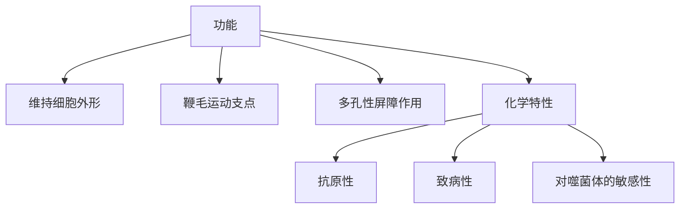
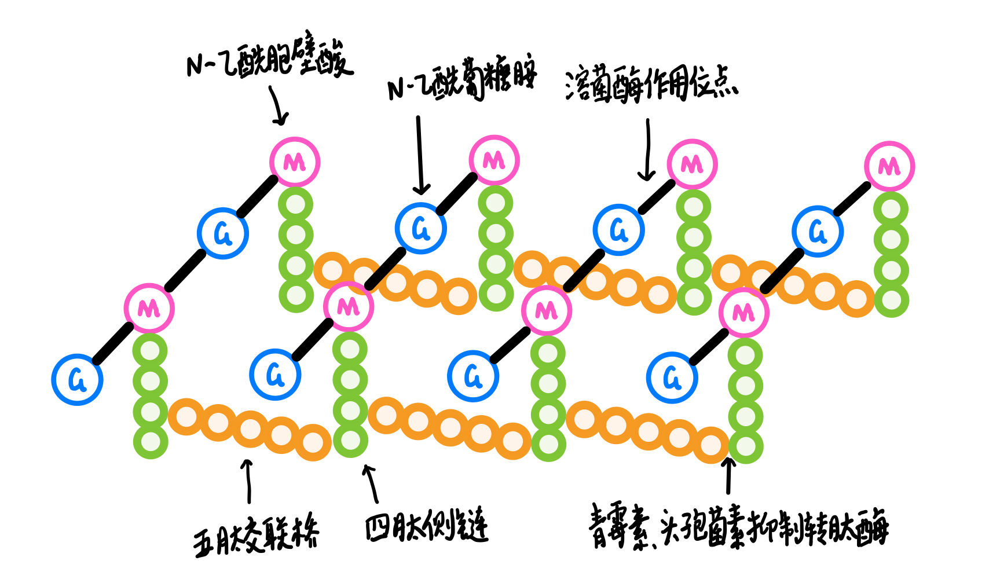
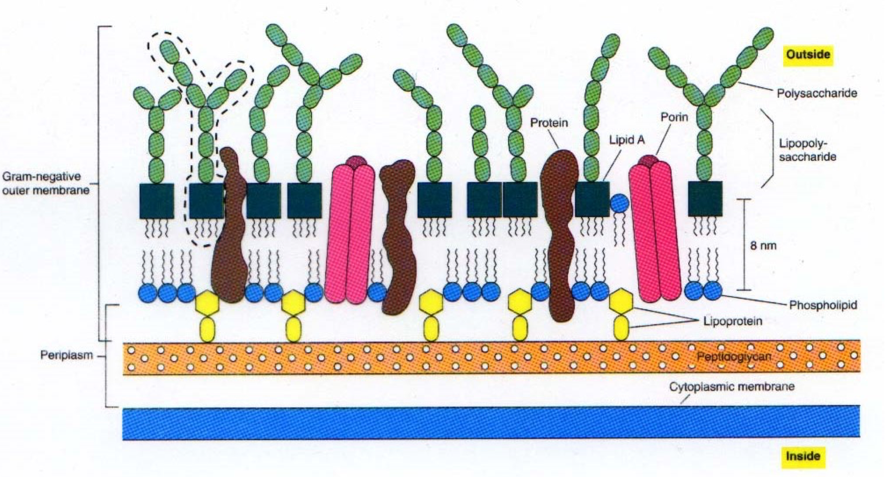
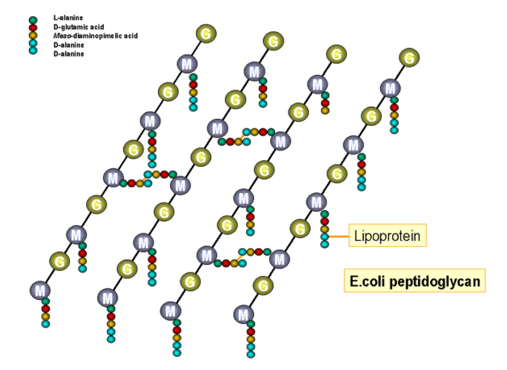
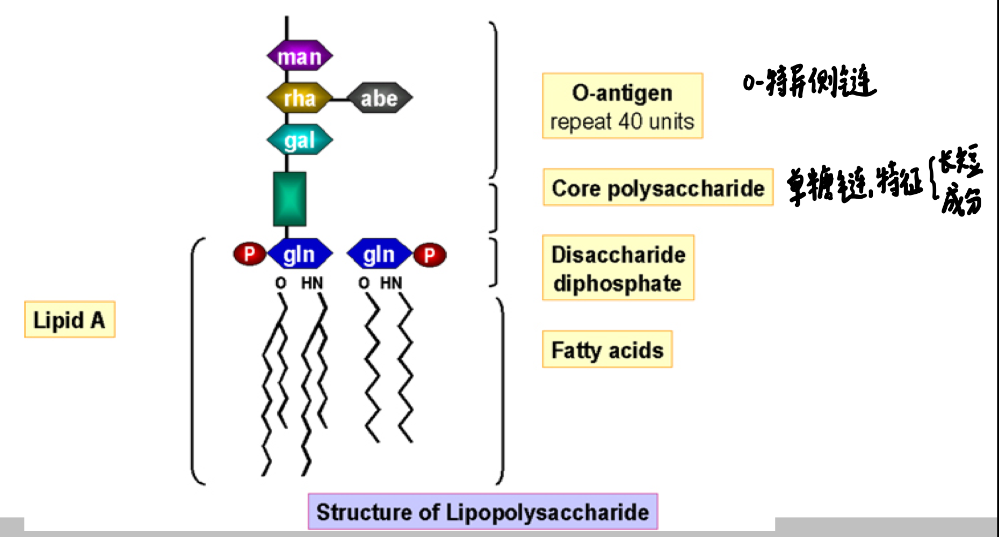

# 第三章 微生物细胞的结构与功能

## 原核微生物

### 细胞壁

功能：

- **维持**细胞外形
- **鞭毛**运动支点
- 多孔性**屏障**作用（大分子）
- 化学特性
  - **抗原**性
  - 致病性
  - 对噬菌体的敏感性

#### 革兰氏阳性菌

肽聚糖含量丰富；特殊组分是磷壁酸

- **肽聚糖**
  - 结构
    - N-乙酰胞壁酸，N-乙酰葡糖胺
    - 四肽侧链氨基酸由D-丙-D-谷-r-L-赖-D-丙组成。
    - 五肽交联桥（甘氨酸）
  - 抑菌剂
    - **溶菌酶（Lysozyme）**能切断肽聚糖中N-乙酰葡萄糖胺和N-乙酰胞壁酸之间的β-1,4糖苷键之间的联苷键之间的联结，破坏肽聚糖支架，引起细菌裂解。
    - **青霉素**和**头孢菌素**能与细菌竞争合成胞壁过程所需的转肽酶，抑制四肽侧链上D-丙氨酸与五肽桥之间的联结。

  
  
- **磷壁酸**
  
  是由核糖醇（Ribitol）或甘油（Glyocerol）残基经由磷酸二键互相连接而成的多聚物。
  
  - 磷壁酸分**壁磷壁酸**和**膜磷壁酸**
    - 壁磷壁酸和细胞壁中肽聚糖的N-乙酰胞壁酸联结
    - 膜磷壁酸又称脂磷壁酸（Lipteichoic acid）和细胞膜联结，另一端均游离于细胞壁外。
  - 作用
    - 革兰氏阳性菌的重要**表面抗原**
    - 调节**离子**通过粘肽层
    - 负电荷环境，大大加强了细胞膜对二价离子的**吸附**，尤其是Mg^2+^。而高浓度Mg^2+^的存在，对于**保持膜的硬度，提高细胞壁合成酶**的活性极为重要
  
- **表面蛋白：SPA、M蛋白**

#### 革兰氏阴性菌

- 肽聚糖

  - 革兰氏阴性菌的四肽侧链中第三位的氨基酸被二氨基庚二酸（DAP）所取代，以肽链直接与相邻四肽侧链中的D-丙氨酸相连
  - 且只有30%的肽聚糖亚单位彼此交织联结，没有五肽交联桥，形成二维平面结构。

  

- 磷脂

  转运营养物质，屏障作用

- 脂蛋白

  一端以蛋白质部分共价键连接于肽聚糖的四肽侧链上另一端以脂质部分经共价键连接于外膜的磷酸上。功能是稳定外膜并将之固定于肽聚糖层。

- 脂多糖LPS——细菌内毒素

  - **类脂A：毒性部分**

  

- 核心多糖

  - 特异性多糖

> 革兰氏染色法：涂片、风干、固定、结晶紫1min、碘液1min、95%乙醇脱色、复红
>

对比

| 细胞壁     | 革兰阳性菌          | 革兰阴性菌         |
| ---------- | ------------------- | ------------------ |
| 强度       | 较坚韧              | 较疏松             |
| 厚度       | 20-80nm             | 10-15nm            |
| 肽聚糖层数 | 可多达50层          | 1-2层              |
| 肽聚糖含量 | 占细胞壁干重50%-80% | 占细胞壁干重5%-20% |
| 磷壁酸     | 有                  | 无                 |
| 外膜       | 无                  | 有                 |
| 脂蛋白     | 无                  | 有                 |
| 结构       | 三维                | 二维               |

#### 细胞壁缺陷细菌

- 原生质体（protoplast）（革兰氏阳性菌）

  必须生存于高渗环境中

- 原生质球（spheroplast）（革兰氏阴性菌）

  细胞壁肽聚糖含量少，虽被溶菌酶除去，但外壁层中脂多糖、脂蛋白仍然全部保留

- 细菌细胞壁缺陷型或L型（滤过型菌）（环境条件下自发去壁）

  - 形态、染色性

    高度多形性，大多染成革兰阴性

  - 培养特性和菌落形态

    生长缓慢，营养要求高，对渗透压敏感，普通营养基上不能生长，培养时必须用**高渗的含血清的培养基**

    油煎蛋样菌落、颗粒型菌落、丝状菌落

### 细胞膜

- 化学反应

  - **呼吸过程**

  - **生物合成过程**

- 结构

  - 不饱和脂肪酸磷脂→流动性

    > 如果磷脂分子中只含饱和脂肪酸，在生理温度下，脂肪酸末端便排列成固定的晶格。
    >
    > 环境温度或某些化学成分的改变，都会引起细胞膜发生"分相"现象，即一部分脂区从流动态变为凝胶态，另一部分则从凝胶态变为流动态。

  - 不含胆固醇

  - 蛋白质

    - 外周蛋白质、固有蛋白质。

    - 渗透酶、合成酶、呼吸酶、ATP合成酶

### 细胞内膜系统

- **中介体（mesosome）**

  > 细胞膜向胞浆凹陷折叠成囊状物，称为中介体，多见于革兰阳性菌。中介体扩大了细胞膜的表面积，相应地增加呼吸酶的含量，可为细菌提供大量能量，与细胞的分裂、呼吸、胞壁合成和芽孢形成有关，其功能类似于真核细胞的线粒体，故亦称为拟线粒体（Chondroid） 。

  - 可能还具有合成细胞壁特别是横隔壁所需的酶、核分裂有关
  - 间体的一边与细胞膜连接，尤其另一边则与核物质紧密接触，起着向核运送物质和能量的作用；
  - 芽孢的形成

- **载色体**（chromatophore）

  - 光合细菌进行光合作用的部位

- 羧酶体（Carboxysome）

  - 自养细菌所特有的内膜结构

  > 含有自养生物所特有的5-磷酸核酮糖激酶和1,5-二磷酸核酮糖羧化酶，这两种酶是卡尔文循环中固定CO~2~的关键性酶类。蓝细菌以及化能自养菌如硝化杆菌科细胞中均具羧酶体。

- 类囊体（thylakoid）

  - 蓝细菌细胞中具有类囊体，蓝细菌进行光合作用的场所。

- 胞质间间隙

  - 革兰氏阴性细菌的细胞膜与细胞壁之间空间
  - 水解酶、青霉素酶

### 细胞质及其内含物

- **气泡**（gasvacuold）

  > 其膜不同于真正的膜，它只含蛋白质而无磷脂。**蛋白质亚单位排列成一个坚硬的结构**，以对抗外部施加于该结构的压力，使之维持正常功能。膜的外表亲水，而内侧绝对疏水，故气泡只能透气而不能透过水和溶质。

- 胞浆颗粒（Cytoplasma granula）

- 异染颗粒（metachromatic granule）

  - RNA和多偏磷酸盐，磷源和能源性贮藏物、随菌龄增长而变大
  - 用蓝色染料（如甲苯胺蓝或甲烯蓝）染色后不呈蓝色而呈紫红色，故称异染颗粒

- 聚β-羟基丁酸Polyhydroxybutyric acid（PHB）

  - 细菌所特有，碳源和能源性贮藏物

  - 脂溶性染料苏丹黑着色

  - pH调节

    > 羟基丁酸分子呈酸性，当其聚合为聚-β-羟基丁酸时就成为为中性脂肪酸了，这样便能维持细胞中内性环境，避免菌体内酸性增高。

- 硫滴（sulfur globules）

  - 硫原贮藏物质

- 肝糖粒和淀粉粒

- 多肽

  - 伴胞晶体

- 核糖体 

  - 70S=50S+30S
  - **链霉素、红霉素的靶点**

- 核质

  - 负电荷被Mg^2+^以及有机碱如精胺、亚精胺和腐胺等中和。

- 质粒

  - 抗药性质粒（R因子），对某些抗生素或其他药物表现抗性；
  - 致育因子（F因子），它是最早发现的与细菌有性接合有关的质粒；
  - 大肠杆菌素质粒（Col因子），使大肠杆菌能产生大肠杆菌素，以抑制其他细菌生长。

  > 质粒可以从菌体内自行消失也可通过物理化学手段，如用重金属、吖啶类染料或高温处理其消除或抑制；
  >
  > 没有质粒的细菌，可通过接合、转化或转导等方式，从具质粒的细菌中获得，但不能自发产生。

### 特殊结构

#### 荚膜 （capsule）

细胞壁外包绕一层较厚的黏液性、胶冻样物质，为疏水性多糖或蛋白质的多聚体。

- 4种类型：荚膜或大荚膜（光学可见）、微荚膜（血清学证明）、黏液层（局部）、菌胶团（连接）。
- 组成：多糖（主要）等。血清学分型基础。
- S/R型：产荚膜常常可突变为无荚膜菌体，被称为S型向R型转化。
- 功能：**碳源贮藏，防干燥，抗吞噬，粘附，抗有害物质的损伤。**

#### 鞭毛（flagellum）

细长并呈波状弯曲的丝状物，是**运动器官**。

- 鞭毛波长：恒定，也可能有两种。
- 是一种很好的抗原物质，鞭毛抗原又叫H抗原。
- 趋性运动：化学趋避运动、光趋避运动。

#### 菌毛 （filus/fimbriae）

**与细菌的运动无关**；抗原性。

- 普通菌毛（Commonpilus）：**粘附结构**。
- 性菌毛（Sexpilus）：见于少数革兰阴性菌
  - **性菌毛能在细菌之间传递DNA**

#### 芽孢（spore）

- 细菌的**休眠形式**。芽孢形成后细菌即失去繁殖能力；都是革兰氏阳性菌
- 实质是微生物发育中所产生的细胞分化现象或称形态发生
- 芽孢的大小、形状、位置等随菌种而异，有重要的鉴别意义。
- 与芽孢相比，未形成芽孢而具有繁殖能力的菌体可称为**繁殖体**
- 结构：核心、内膜、芽胞壁、皮质、外膜、芽孢壳和芽孢外衣。
  - 芽孢核心和皮质层中含有大量吡啶二羧酸（Dipicolinic acid,DPA）,是芽孢所特有的成分
- 外界条件：因菌种而异。
- 抗热性：DPA；**渗透调节皮层膨胀学说**。
- 芽孢萌发：条件，过程。
- 功能：抗逆

#### 孢囊（cyst）

- 由营养细胞缩短变成球形，表面形成一层厚的孢壁。
- 很弱的内源性呼吸，抗干燥，抗机械性破坏，抗紫外线和电离辐射。**与芽孢相比，它们并不特别抗热，完全休眠，它们还能迅速氧化外源性的能源。**
- 孢囊的形成，对碳源各类很敏感；**在适宜的条件下，孢囊萌发**。

#### 伴孢晶体

- 是多肽类物质
- 一个细菌一般只产生一个伴孢晶体
- 对昆虫有毒，对人畜毒性很低。

## 真核微生物

包括：显微藻类、原生动物、粘菌、假菌、真菌（**酵母菌** **霉菌**）

- 真菌的菌体除少数为单细胞外，多数由不分隔或分隔的菌丝体组成。

- 真菌的**繁殖方式**，除了小段菌丝的再生外，主要是形成多种形式的无性孢子和有性孢子，繁殖特征是真菌分类的主要依据。

- 真菌和藻类的主要**区别**在于真菌没有光合色素，不能进行光合作用。所有真菌都是有机营养型的，而藻类则是无机营养型的。真菌和原生动物的主要区别在于真菌有细胞壁，而原生动物则没有细胞壁。

### 细胞壁

- 低等真菌中，以纤维素为主；
- 酵母菌，以葡聚糖为主；
- 高等陆生真菌，以几丁质为主。

有些酵母菌细胞与其子代细胞连在一起成为链状，称为**假丝酵母**。酵母菌无鞭毛，**不能游动。**

- 酵母菌细胞壁具三层结构——外层为甘露聚糖，内层为葡聚糖，其间夹有一层蛋白质分子。

### **鞭毛与纤毛** 

- 形态较长（150～200 μm）、数量较少者称为鞭毛；

- 而形态较短（5～10μm）、数量较多者称为纤毛。

它们在运动功能上虽与原核微生物的鞭毛相同，但在**构造、运动机制等方面却差别极大**。

真核微生物的鞭毛与纤毛构造基本相同，都由**基体、过渡区、鞭杆（“9+2”型）**三部分构成。

- **“2”是一对相互平行的中央微管，位于鞭毛中心**

- **“9”是9个微管二联体，位于中央微管外，并围绕一圈**
  - 微管二联体
  - **A亚纤微：13个球形微管蛋白和2条动力蛋白臂（ATP酶）**——Ca2+、Mg2+
  - **B亚纤微：10个球形微管蛋白**

### 细胞膜

7 ~ 10nm厚，与原核细胞（及其他真核细胞）在构造和功能上十分相似，两者的主要差异可能仅是由于**构成膜的磷脂和蛋白质种类不同而形成的。**
此外，在化学组成中，真菌细胞的质膜中具有**甾醇**，而在原核生物的质膜中很少或没有甾醇。

| 项目         | 原核生物                                                     | 真核生物                                                     |
| ------------ | ------------------------------------------------------------ | ------------------------------------------------------------ |
| 甾醇         | 除支原体外没有                                               | 胆甾醇、麦角甾醇                                             |
| 磷脂种类     | 磷脂酰甘油和磷脂酰乙醇胺                                     | 磷脂酰胆碱和磷脂酰乙醇胺                                     |
| 脂肪酸种类   | 直链或分枝 饱和或不饱和  每一磷脂分子常含饱和与不饱和脂肪酸各一 | 高等真菌：含偶数个碳原子的脂肪酸； 低等真菌：含奇数个碳原子的不饱和脂肪酸 |
| 糖脂         | 无                                                           | 有                                                           |
| 电子传递链   | 有                                                           | 无                                                           |
| 胞吞作用     | 无                                                           | 有                                                           |
| 基团转移运输 | 有                                                           | 无                                                           |

- 细胞膜功能的衰退

### 细胞核

- 细胞核
- 染色体外DNA
  - 线粒体DNA
  - 酵母2μm质粒DNA

### **细胞质和细胞器**

（1）**膜边体（lomasome）**位于菌丝细胞四周的质膜与细胞壁间，由单层膜包裹的细胞器，可能与水解酶或合成细胞壁有关。

（2）**几丁质酶体（chitosome）**一种活跃在各种真菌菌丝体顶端细胞中的微小囊泡，含几丁质合成酶。

（3）**氢化酶体（hydrogenosome）**一种由单层膜包裹的球状细胞器，内含氢化酶，氧化还原酶，铁氧还原蛋白和丙酮酸。通常位于鞭毛基体附近为其运动提供能量，只存在于厌氧性的原生动物和厌氧性真菌中。

### **内含物**

有异染粒、淀粉粒、肝糖、油脂颗粒等

## 总结

真核生物与原核生物的比较

| 比较项目       | 原核生物               | 真核生物               |
| -------------- | ---------------------- | ---------------------- |
| 细胞大小       | 较小(通常直径小于 2μm) | 较大(通常直径大于 2μm) |
| 细胞壁主要成分 | 多数为肽聚糖           | 纤维素、几丁质等       |
| 细胞壁结构     | G+：多层肽聚糖         | 三层“肉夹馍”           |
| 细胞膜         | 见上                   |                        |
| 鞭毛结构       | 如有，则细而简单       | 如有，则粗而复杂       |
| 鞭毛运动方式   | 旋转马达式             | 挥鞭式                 |
| 繁殖方式       | 无性繁殖               | 有性、无性等多种       |
| 细胞器         | 无                     | 有                     |

 

