# 二、微生物的纯培养与显微技术

第二版：按照老师导图整理

## 微生物的分离与纯培养

> **纯培养：**把一个细胞或一群相同的细胞经过培养繁殖而得到的后代的过程称为纯培养（等价于克隆）

### 无菌技术

>  **无菌技术：**在分离，转接与培养纯培养物时防止被其他微生物污染的技术。

#### 物品灭菌

> ref: https://wenku.baidu.com/view/4c3a92575beef8c75fbfc77da26925c52cc591f4.html?fr=search-1-income6

1. 器皿
   - 金属
     - 接种针/环：火焰灼烧
   - 玻璃
     - 高压锅（热压，湿热灭菌法）：又快效果又较好，最常用
     - 烘箱（干热）：温度要求高
     - （也可灼烧）
   - 热敏
     - 间歇灭菌法
       - 先升温（不太高）再降温再升温……
       - 使芽孢萌发，再杀之
     - 过滤
       - 热敏的器皿、样品
       - 越小的细菌要求孔径越小
2. 环境
   - 紫外
     - 穿透力弱，只能表面杀菌，还可能光复活
     - 工作距离：70cm
   - 辐射
     - 穿透力强
     - 但影响试剂活性、需要防护

#### 操作人员

- 手套、口罩
- 头发扎起来
- 首饰等……

#### 接种方法

  > 接种： 将微生物的培养物或含有微生物的样品移植到培养基上的操作技术

  + 斜面接种法：**斜到斜**。从已生长好的斜面培养基上挑取少量菌种并接种到另一支斜面培养基中。

    

  + 液体接种法：**斜到液**。从已生长好的斜面培养基上挑取少量菌种并接种到液体培养基中。

    由斜面菌接种到液体培养基（如试管或三角瓶等）中的方法。
    操作与上法基本一致，只是在将接种环送入液体培养基中时使环在液体与管璧接触的地方轻轻磨擦，使菌体分散，然后塞上棉塞，再轻轻摇动均匀，即可培养。如果菌种是培养在液体培养基中时，一般用移液管或滴管接种。

  + 穿刺接种法：用于**半固体**、醋酸铅、三糖铁琼脂与明胶培养基的接种。
    + 必须使用**笔直的接种针**而不能使用接种环；
    + 向培养基**中心**穿刺，再沿**原路抽出**针；
    + 接种针不应在培养基内左右晃动。
    
  + 平板接种法：
    + 由斜面向平板接种
      + 划线法：见平板划线分离法
      + 点种法：一般用于观察霉菌和酵母细胞，轻轻点在平板的表面（根霉点一点，曲霉、酵母可点3-4点）即可
    + 由平板向斜面接种
      + 将经平板分散培养得到的单菌落接种到斜面，以便作**鉴定**或**扩大**培养、**保存**之用

> 菌落$\to$众多菌落连成一片$\to$菌苔

### 复杂环境高浓度微生物纯培养

#### 液体稀释法

> 注意不是在液体中培养。老师是按在什么介质分离来分类的，书上是按分离完在什么介质培养来分的。
> 分清楚哪个是分离，哪个是培养！

- 特点

  - 将分离的样品连续稀释、高度稀释，**使一支试管中分配不到一个微生物**；
  - 如果经过稀释后大多数试管中都没有微生物生长，那么有微生物生长的试管可能是由一个微生物个体繁殖而来的纯培养物；
  - 适用于**细胞较大**的微生物；

- 液体稀释后的培养方法分类

  

  - 稀释涂布平板（平板涂布分离）
    - 一定稀释度的样品涂在平板上；
    - 简单易行，但可能**不均匀**，容易造成**机械损伤**。
  - 稀释到平板
    - 稀释液和琼脂混合倒入平皿，菌落还出现在平板内部；
    - 缺点：操作较为**麻烦**；对**好氧菌**、热敏感菌效果不好。
  - 稀释液体培养：直接用稀释液培养。

#### 固体稀释法：平板划线分离法

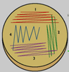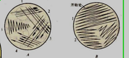

+  特点：快速、方便
+  划线方法：
   1. **分区**划线（最右）：适用于浓度较**大**的样品
   2. **连续**划线（左中）：适用于浓度较**小**的样品
   
   > 我理解的分区划线：先划线1，然后**灭菌**，再蘸取线1末端的培养液，划线2，这样，每划一次线，初始菌量都减少，所以最终稀释倍数高。

#### 厌氧微生物的分离

+ 稀释摇管法
  + 先将一系列盛无菌[琼脂](https://baike.baidu.com/item/琼脂/103981)培养基的试管加热使琼脂熔化后冷却并保持在50℃左右，然后将待分离的材料用这些试管进行梯度稀释，试管迅速摇动均匀，冷凝后，<u>在琼脂柱表面倾倒一层灭菌液体石蜡和固体[石蜡](https://baike.baidu.com/item/石蜡/1022042)的混合物，将培养基和空气隔开</u>。培养后，菌落形成在琼脂柱的中间。
  + 对于那些对氧气**更为敏感**的厌氧性微生物的**分离**手段
  
  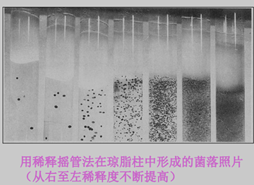
  
+ 操作、培养

  + 厌氧罐：H~2~消耗氧气
  + 厌氧手套箱

  

#### 选择培养分离

> 为了从混杂的微生物群体中分离出某种微生物，可以根据该微生物的特点，包括营养、生理、生长条件等，采用选择培养的方法进行分离
>
> 没有一种培养基或一种培养条件能够满足自然界中一切生物生长的要求，在一定程度上所有的培养基都是选择性的。

 1. 选择培养基

    - 使待分离的微生物生长“突出”：**直接挑取**待分离的微生物的菌落获得**纯培养**
    - **抑制**大多数**其它**微生物的生长；使待分离的微生物生长更快：方便用**稀释法**对其进行纯化。

    > 举例
    >
    > + 牛奶平板：分离高蛋白酶产生菌
    > + 颜色反应：分离特定的菌株（产生色素或者受到外界影响而变色）
    >
    > + 利用细菌滑动特点进行分离纯化
    >
    > + 高温培养：分离嗜热菌
    >
    > + 培养基不含氮：分离固氮菌
    >
    > + 培养基加抗生素：分离抗性菌

 2. 富集培养（见下）

### 低浓度微生物纯培养技术

#### 膜过滤

过滤稀溶液，菌留在滤膜上，然后去培养。

富集低浓度微生物，检测浓度（较准确）。

#### 单细胞分离

采用显微分离法从混杂群体中直接分离（**占比较少的**）单个细胞或单个个体以获得纯培养的方法。个体越小越困难。

1. 毛细管法：用毛细管提取微生物个体，适合于**较大**微生物

2. 显微操作仪：用显微针、钩、环等挑取单个细胞或孢子以获得纯培养

3. 小液滴法：将经过适当稀释后的样品制成小液滴，在显微镜下**选取只含一个细胞的液滴**来进行纯培养物的分离

#### 富集培养

特定的环境条件→仅适应于该条件的微生物旺盛生长→待分离微生物在群落中的数量大大增加→从自然界中分离到所需的特定微生物。

改变生理、营养条件，使它有分离几乎所有微生物的潜力。

### 二元培养物

培养物中只含有二种微生物，而且是有意识地**保持**二者之间的**特定关系**的培养物称为二元培养物。举例：

+ 病毒和宿主细胞

+ 纤毛虫、变形虫和粘细菌

### 微生物的保藏技术

1.  影响菌种稳定性的因素

   +  变异

   + 污染

   + 死亡

2. 细菌的衰退和复壮
   1. 细菌的衰退
      + 菌种衰退（degeneration）：是指由于**自发突变**的结果，而使某物种原有的一系列生物学性状发生量变或质变的现象
      
        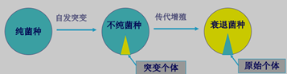
      
   2. 细菌的复壮

      1. 狭义的复壮（消极措施）

         是指在菌种已经发生衰退的情况下，通过纯种分离和测定典型性状、生产性能等指标，从已衰退的群体中**筛选出少数尚未退化的个体**，以达到恢复原菌株固有性状的相应措施

      2. 广义的复壮（积极措施）

         是指在菌种的典型特征或生产性状**衰退前**，就经常有意识地采取纯种分离和生产性状测定工作，以期从中选择到**自发的正突变个体**

4. 菌种复壮的方法

    1. **纯种分离**法
    
       通过纯种分离，可将衰退菌种细胞群体中一部分仍保持原有典型性状的单细胞分离出来，经扩大培养就可恢复原菌株的典型性状。
    
    2. **淘汰法**
    
       将衰退菌种进行一定的处理（如药物、低温、高温等），往往可以起到淘汰已衰退个体而达到复壮的目的
    
    3. **遗传育种法**
    
       把**退化**的菌种**重新**进行遗传**育种**，从中再选出高产而不易退化的稳定性较好的生产菌种。

3. 菌种的保藏

   1. 菌种保藏的目的

      广泛收集实验室和生产菌种、菌株（包括病毒株以及动、植物细胞株和质粒等）的基础上，使之达到		不死、不衰、不乱以及便于研究、交换和使用的目的。

   2. 菌种保藏的原理

      ​	1. 挑选典型菌种的**优良纯种**来进行保藏，最好保藏它们的**休眠体**，如分生孢子、芽孢等

      ​	2. 人为创造环境条件（如：干燥、低温和缺氧），使微生物长期处于代谢**不活泼**、生长繁殖受抑制的休		眠状态

      ​	3. 尽可能多的采用**不同的手段**保藏一些比较重要的微生物菌株

   3. 菌种保藏的方法

      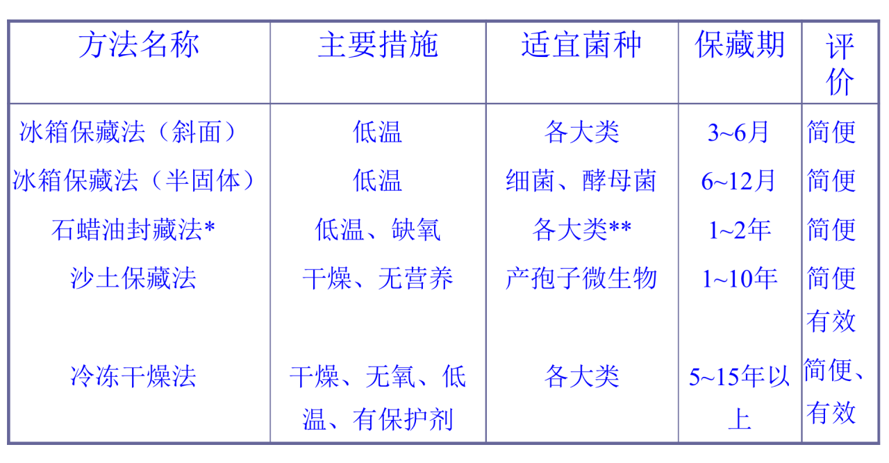

思考题：为什么说Koch等建立的微生物纯培养技术是微生物学建立与发展的基石？一般可用哪些方法获得微生物的纯培养？

### 显微镜和显微技术（无要求）

## 显微镜下的微生物

> 细菌是单细胞原核微生物，个体微小，形态简单，以二等分裂方式繁殖。在自然界中，细菌分布最广、数量最多。
>
> 基本形态：球状、杆状、螺旋状
>
> 其他形态：
>
> - 柄杆菌细胞上有柄、菌丝、附器等细胞质伸出物，细胞呈杆状或梭状，并有特征性的细柄
> - 球衣菌能形成衣峭，杆状的细胞呈链状排列在衣鞘内而成为丝状
> - 支原体只有细胞膜，没有细胞壁，故细胞柔软，形态多变，具有高度多形性
> - 细胞呈星形和方形的细菌

### 细菌

#### 个体形态

##### 球菌

1. 单球菌
   + 分裂后的细胞分散而**单独存在**的球菌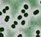

2. 双球菌
   + 分裂后两个球菌**成对排列**的为双球菌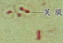

3. 链球菌
   + 分裂是沿**一个平面**进行，分裂后细胞排列成**链状**

4. 四链球菌
   + 分裂是沿**两个相垂直的平面**进行分裂，分裂后每四个细胞在一起呈**田字形**

5. 八叠球菌
   + 按**三个互相垂直的平面**进行分裂后，每八个球菌在一起成**立方体形**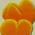

6. 葡萄球菌
   + 分裂面**不规则**，**多个**球菌聚在一起，像一串串葡萄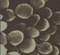

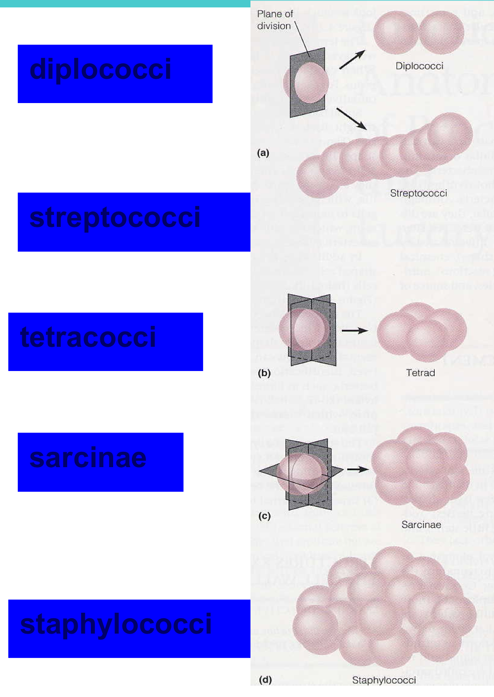

##### 杆菌

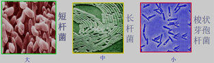

杆菌是细菌中种类最多的类型，因菌种不同，菌体细胞的长短、粗细等都有所差异

杆菌的形态：

+ 分类
  + 短杆状、长杆状、棒杆状、梭状、梭杆状、月亮状、分枝状、竹节状等
  + 按杆菌细胞的排列方式则有链状、栅状、“八” 字状以及有鞘衣的丝状等
+ 特点
  + 两端齐平过渡到两端尖细
  + 一般情况下，同一种杆菌的宽度比较稳定，但它的长度经常随培养时间、培养条件的不同而有较大的变化。
  + **芽孢杆菌**：芽孢可能小于/大于杆菌宽度，位置可能在中部或一端

##### 螺旋菌

细菌中最少的类型

1. 弧菌：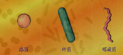

   + 螺旋不满一圈，菌体呈弧形或逗号形

   + 如：霍乱弧菌、逗号弧菌
2. 螺旋菌：

   + 螺旋满2~6环，螺旋状，两端有鞭毛
   + 如：干酪螺菌
3. 螺旋体
   - 螺旋超过6环

##### 异常形态

1. 畸形：由于化学或物理因子的刺激，**阻碍了细胞的发育**而引起的形态异常。
2. 衰颓形：由于培养时间过长，细胞**衰老**，**营养**缺乏，或因自身代谢产物**积累**过多等原因而造成的形态异常。这种细胞，繁殖能力丧失，形体膨大，形成液泡，着色力弱，有时菌体尚存，实已死亡了。

##### 影响细菌形态的因素

培养时间、培养温度、培养基成分、浓度、pH

2.  一般处于**幼龄**阶段和生长**条件适宜**时，细菌形态正常、整齐，表现出特定的形态

2. 在较老的培养物中，或不正常的条件下，细胞常出现不正常形态

#### 群体形态

##### 类型

固体培养时的群体形态：

- 菌落(colony) 

- 单菌落(clone)

- 菌苔(lawn)

  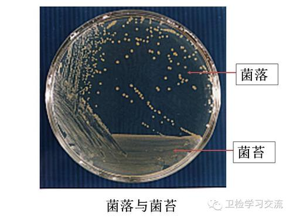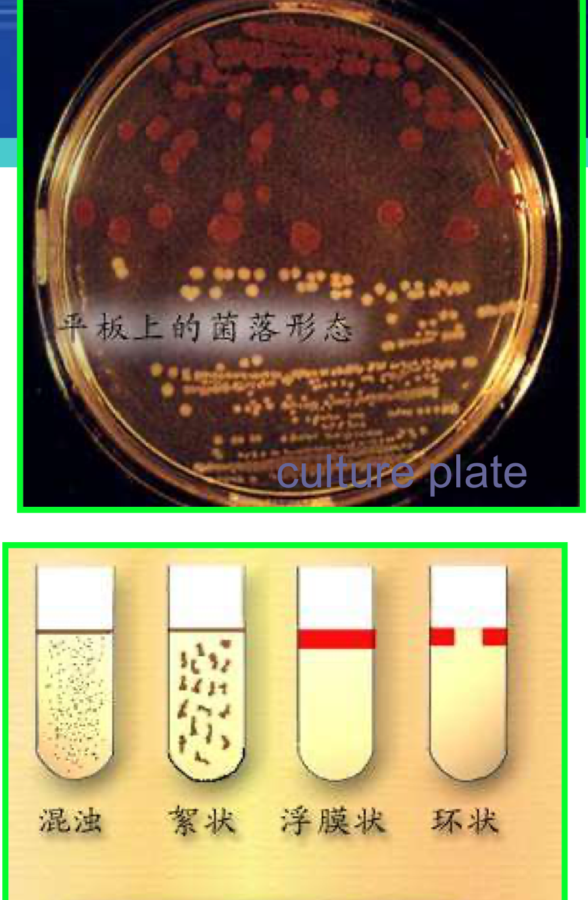
  
  

液体培养时的群体形态：

- 浑浊
- 絮状（聚集）
- 浮膜状（好氧）
- 环状（贴壁）

##### 菌落形态

不同的微生物种类，其菌落特征不同。同一种菌在不同培养条件下菌落特征也不尽相同。

菌落的特征包括：

1、大小 2、颜色 3、透明度 4、表面状态 5、质地 6、边缘形态 7、隆起形状 (正面观)

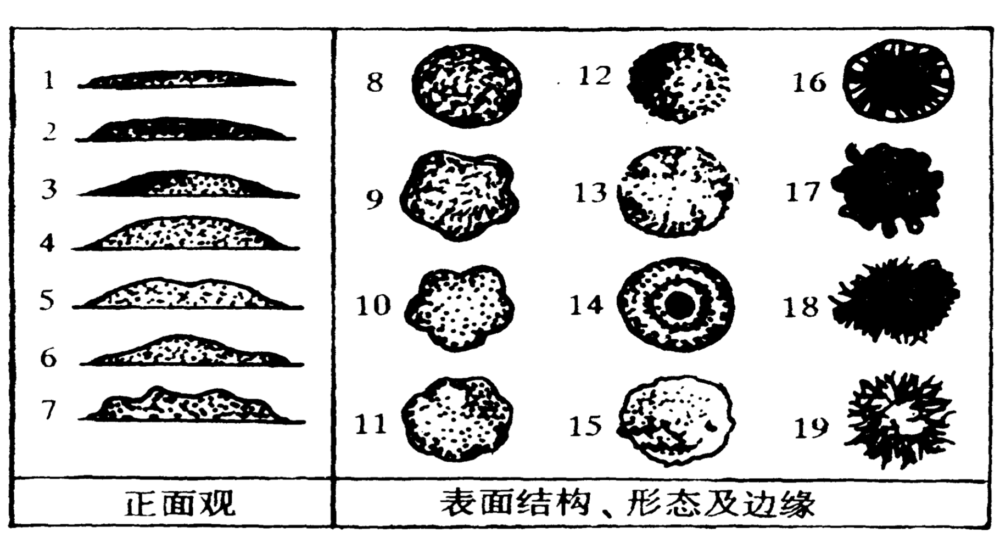

##### 影响菌落形态的因素

+ 邻近菌落
+ 培养时间
+ 培养基成分
+ 培养温度

### 放线菌

放线菌是一类具有丝状分枝细胞和无性孢子的G^+^原核微生物，由于菌落呈放射状而得名。

#### 菌丝

+ 营养菌丝
  + 吸收营养；产生色素
+ 气生菌丝
  + 分化为孢子丝
+ 孢子丝
  + 可形成孢子；用来分类

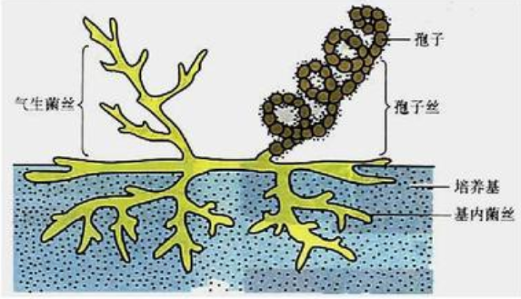

#### 孢子

#### 菌落形态

- 质地：**致密、干燥、多皱**、小而不蔓延、**不易挑起**，表面有放射状沟纹。
- 形状：随菌种不同可有两类
  1. 产生大量分枝状菌丝的菌种：如Strptomyces形成与培养基结合较紧的菌落，不易挑起或整个挑起。
  2. 不产生大量菌丝的菌种：如Nocardia形成的菌落呈粉质，挑之易碎

###  真菌

#### 酵母菌

1. 特点（了解）

   + 单体一般以单细胞状态存在

   + 多数出芽繁殖也有的裂殖

   +  能发酵糖类产能

   + 细胞壁常有甘露糖

   + 喜在含糖较高酸度较大的环境中生长

2. 个体形态

   + 通常为**圆形、卵圆形或者椭圆形**

     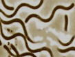

   + 也有特殊形态：柠檬形、三角形、节藕状、腊肠形、假菌丝等

     > 假菌丝：酵母菌在一定条件下培养，产生的芽体与母细胞不分离形成的特殊状态

     

3. 大小

   +  酵母菌**比细菌粗**约10倍，其直径一般为2~5μm，长度为5—30μm， 最长可达100μm

   + 酵母的大小、形态与菌龄、环境有关。一般**成熟**的细胞**大**于幼龄的细胞，液体培养的细胞大于固体培养的细胞

4. 群体形态

   + 固体培养

     + 菌落：**大而厚，圆形，光滑湿润，粘性，颜色单调**。
     + 常见白色、土黄色、红色

   + 液体培养

     液体培养基上，不同的酵母菌生长的情况不同。

     + 好气性生长的酵母可在培养基表面上形成菌膜或菌醭，其厚度因种而异。
     + 有的酵母菌在生长过程中始终沉淀在培养基底部。
     + 有的酵母菌在培养基中均匀生长，使培养基呈浑浊状态。

#### 霉菌

1. 霉菌的概念（了解）

   + 霉菌是丝状真菌的统称。

   + 凡是在营养机制上能形成绒毛状、网状或絮状菌丝体的真菌统称为霉菌

   + 真菌界-子囊菌纲-半知菌类

2. 霉菌的形态结构

   + 霉菌的菌体由分支或不分枝的菌丝构成，菌丝是真菌营养体的基本单位
   + 霉菌的菌丝呈中空管状结构，直径一般3~10μm，有分支，可能有隔膜
     + 有隔膜成为高等真菌，没有隔膜成为低等真菌
   + 许多菌丝分支连接，相互交织在一起构成的形态称为菌丝体
  
3. 菌丝类型

   1. 按形态分
      - **营养菌丝**：在固体培养基上伸入基内的菌丝。行使**吸收养料**的功能
      - **气生菌丝**：向空中生长的菌丝。发育到一定阶段可分化成为**繁殖（孕育）菌丝**

   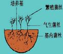

   2. 按分化程度分

      - **无隔菌丝**：这是**低**等真菌所具有的菌丝类型。

        为长管状**单细胞**，细胞质内含多个核。其生长表现为**菌丝的延长和细胞核**的增多。

      - **有隔菌丝**：这是**高**等真菌所具有的类型
      
        菌丝中**有隔膜**，被隔膜隔开的一段菌丝就是一个细胞，菌丝由**多个细胞**组成，每个细胞内有一至多个核。隔膜上有单孔或多孔，细胞质和细胞核可**自由流通**，每个细胞功能相同。
        
        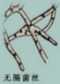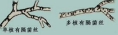

3. 菌丝变态

   - **吸器**。由专性寄生霉菌如锈菌、霜霉菌和白粉菌等产生的菌丝变态，它们是从菌丝上产生出来的旁枝，侵入细胞内分化成根状、指状、球状和佛手状等，用以**吸收寄主细胞内的养料**。
- **假根**。根霉属霉菌的菌丝与营养基质接触处分化出的根状结构，有**固着和吸收养料**的功能。
   - **菌网和菌环**。某些捕食性霉菌的菌丝变态成环状或网状，用于**捕捉其它小生物**如线虫、草履虫等。 
- **菌核**。大量菌丝集聚成的紧密组织，是一种**休眠体**，可抵抗不良的环境条件。其外层组织坚硬，颜色较深；内层疏松，大多呈白色。如药用的茯苓、麦角都是菌核。
   - 子实体。是由大量气生菌丝体特化而成，子实体是指在里面或上面可产生孢子的、有一定形状的任何构造。例如有三类能产有性孢子的结构复杂的子实体，分别称为闭囊壳、子囊壳和子囊盘。

5. 霉菌的培养特征

   + 液体培养特征：

     + 如果是**静止**培养，菌丝往往在液体表面生长，液面上形成**菌膜**。

     + 如果是**震荡**培养，菌丝可相互缠绕在一起形成菌丝**球**，亦可形成**絮片状**，与震荡震荡速度有关。

   + 菌落特征：
     + 霉菌的菌落大、疏松、干燥、不透明，多呈绒毛状、絮状或网状等；
     + 菌体可沿培养基表面蔓延生长，由于不同的真菌孢子含有不同的色素，所以菌落可呈红、黄、绿、青绿、青灰、黑、白、灰等多种颜色。

#### 藻类

#### 原生动物

