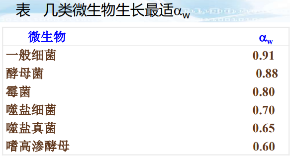

# 第四章 微生物的营养

## 微生物的营养需求

### 微生物细胞的化学组成

#### 微生物细胞中的化学元素

1. 元素组成
   - 构成微生物细胞的大量元素：**C、H、O、N**、P、S、K、Mg、Ca、Fe，其中前六种元素占细菌细胞干重的97%。
   - 构成微生物细胞的微量元素：锌、锰、钠、氯、钼、硒、钴、铜、钨、镍、硼等。

2. 主要以**有机物、无机盐、水**的形式存在于细胞中。
   1. 有机物：蛋白质、糖类、脂质、核酸、维生素及其降解产物；
   2. 无机盐：
      1. 参与有机物组成；
      2. 单独以无机盐的形式存在于细胞质内。  
   3. 水：约占细胞总重70%\~90%；以**游离水和结合水**两种形式存在。
      1. 游离水：可由干重法测得；
      2. 结合水：不易蒸发、冻结，不能渗透，占水总量的17%\~28%。

#### 微生物细胞的化学成分

1. 影响因素：与微生物**种类、菌龄、培养条件**有关。
2. 与其他生物相比，微生物细胞内的共有成分和特殊成分
   1. 共同成分：**水、无机盐、蛋白质、糖类、脂质、核酸**等；
   2. 特殊成分：肽聚糖、胞壁酸、磷壁酸、D型氨基酸、二氨基庚二酸、吡啶二羧酸等。
3. 微生物中的化学成分分析方法
   1. 有机成分
      1. 化学方法抽提后进行定性与定量分析；
      2. 细胞破碎、获得亚显微结构进行分析。
   2. 无机成分
      1. 灰分测定无机成分；
      2. 测定湿重、干重、细胞含水量。

### 营养物质及其功能

能源：能为微生物生命活动提供**能量来源**的营养物质或辐射能称为能源。

营养物质的分类：**碳源、氮源、无机盐、生长因子、水**等。一种物质可同时是多种营养物质。

#### 碳源

##### 种类和功能

1. 定义：<u>所有可用来构成细胞物质或代谢产物中碳元素来源的营养物质</u>。
2. 功能：
   1. 提供合成细胞物质的**原料**（构成代谢产物的**骨架**）；
   2. 为微生物的生理活动提供**能量来源**（异养微生物为主）。
3. 种类：
   1. **无机**含碳化合物，如CO~2~、碳酸盐等；
   2. **有机**含碳化合物，如糖类及其衍生物、脂类、醇类、有机酸、烃类、芳香族化合物等。

##### 微生物的碳源谱

| 种类   | 元素组成  | 化合物                   | 培养基原料                       |
| ------ | --------- | ------------------------ | -------------------------------- |
| 有机碳 | C H O N X | 复杂蛋白质、核酸等       | 牛肉膏、蛋白胨、花生饼粉等       |
|        | C H O N   | 多数氨基酸、简单蛋白质等 | 一般氨基酸、明胶等               |
|        | C H O     | 糖类、有机酸、醇、脂类等 | 葡萄糖、蔗糖、淀粉等             |
|        | C H       | 烃类                     | 天然气、石油及其他馏分、石蜡油等 |
| 无机碳 | C         | --                       | --                               |
|        | C O       | CO~2~                    | CO~2~                            |
|        | C O X     | NaHCO~3~                 | NaHCO~3~、CaCO~3~等              |

#### 氮源

##### 氮源的种类和功能

1. 定义：凡用于构成微生物细胞物质或代谢产物中氮元素来源的营养物质。
2. 种类：
   1. **无机**氮：铵盐、硝酸盐（几乎所有微生物都能利用）、亚硝酸盐、氨等；N~2~（固氮微生物）等；
   2. **有机**氮：蛋白质及其降解产物（胨、肽、氨基酸等）、尿素、牛肉膏、鱼粉、花生饼粉、黄豆饼粉、玉米浆等。
3. 功能：
   1. 提供细胞中含氮物（如蛋白质、核酸以及含氮代谢产物）的**合成原料**；
   2. 少数细菌可以铵盐、硝酸盐等作为**能源**。

##### 微生物的氮源谱

| 种类   | 元素组成  | 化合物                         | 培养基原料                       |
| ------ | --------- | ------------------------------ | -------------------------------- |
| 有机氮 | N C H O X | 复杂蛋白质、核酸等             | 牛肉膏、酵母膏、饼粕粉、蚕蛹粉等 |
|        | N C H O   | 尿素、多数氨基酸、简单蛋白质等 | 尿素、蛋白胨、明胶等             |
| 无机氮 | N H       | 铵盐、NH~3~等                  | (NH~4~)~2~SO~4~等                |
|        | N O       | 硝酸盐等                       | KNO~3~等                         |
|        | N         | N~2~                           |                                  |

##### 速效氮源与迟效氮源

1. **迟效氮源**：蛋白氮必须**降解**为胨、肽、氨基酸后才能被菌体吸收利用，这种氮源称为迟效氮源。

   迟效氮源通常有利于**代谢产物**的形成。

2. **速效氮源**：无机氮源或有机氮源（如蛋白质降解产物）可以**直接**被菌体吸收利用，这种氮源称为速效氮源。

   速效氮源通常有利于**机体的生长**。

#### 无机盐

1. 定义：为微生物细胞生长提供<u>碳、氮源以外</u>的多种重要元素（大量元素、微量元素）的物质，多以无机物的形式供给，称为无机盐。
2. 一般微生物所需无机盐种类：硫酸盐、磷酸盐、氯化物，以及含有Na、K、Mg、Fe等金属离子的化合物。
3. 功能：
   1. 微生物细胞的**组成成分**；
   2. 调节微生物细胞**渗透压、pH值和氧化还原电位**；
   3. 有些无机盐可以作为**自养**微生物的**能源**；
   4. 构成**酶活性基**的成分，维持酶的活性（Mg、Ca、K离子是多种酶的激活剂）。

#### 生长因子

1. 定义：对微生物正常生活**不可或缺、需要量不大**，且微生物自身无法用碳源或氮源合成或**合成量不足**以满足机体生长需要的有机营养物质。

2. 包含：**维生素、氨基酸、碱基**等。

3. 来源（了解）

   > 1. 微生物的维生素来源：部分微生物自身不能合成维生素，需要通过外界来提供，以B族维生素为主，包括**硫胺素、叶酸、泛酸、核黄素、生物素**等。
   >
   > 2. 微生物的氨基酸来源：部分微生物自身无法合成某种氨基酸，必须从外界补充。例如，赖氨酸发酵所用黄色短杆菌不能合成环丝氨酸，需在培养基中额外添加环丝氨酸。
   >
   >    >
   >    > 各类微生物合成氨基酸的能力差别很大，一般情况下，**革兰氏阴性菌（G^-^）强于革兰氏阳性菌（G^+^）**。例如，大肠杆菌能合成全部氨基酸，沙门氏菌能合成大部分；而肠道串珠菌自身合成氨基酸的能力极弱，需要从外界补充19种氨基酸。
   >
   > 3. 微生物的碱基来源：部分微生物不仅无法合成嘌呤和嘧啶，还无法将外源碱基结合在核苷酸上，必须额外供给核苷酸。
   >
   >    > 碱基包含嘌呤和嘧啶，是核酸和辅酶的重要组成成分，是微生物的必要生长因素。
   >
   > 4. 部分微生物还需要补充卟啉或其衍生物、低碳脂肪酸、肌醇、胆碱等。

4. 微生物根据对生长因子的需要程度不同，可分为：

   1. **野生型**：**不需要生长因子**就能在基础培养基上生长的菌株；
   2. **营养缺陷型**：某些菌株发生突变后，失去合成某种或某些对该菌株生长不可缺少的物质（主要为生长因子）的能力，必须从外界摄取才能生长繁殖。

#### 水

##### 功能

1. 水是细胞中生化反应的**良好介质**：营养物质和代谢产物溶解在水里吸收或排出；
2. 水的**比热高**，有效吸收代谢过程产生的热量，**维持细胞温度的稳定**；
3. 水能维持细胞的膨压，控制**细胞形态**。

##### 水活度（α~w~）

1. 定义：微生物**对水的需要程度**常用环境（或基质）中的水活度表示。水活度α~w~是指在相同的温度和压力下，**溶液中水的蒸汽压和纯水蒸汽压之比**，即$\alpha_w=\dfrac{P_{溶液}}{P_{纯水}}$。

2. 微生物生存与水活度：微生物的生长所需水活度通常在0.60\~0.99之间；细菌水活度较高，约为0.9；酵母菌次之；耐旱微生物水活度在0.6左右。

   

3. 溶质对水活度的影响：水中溶质浓度越高，水活度越低。

4. 相对湿度RH=α~w~×100，通常使用测定蒸汽相中相对湿度的方法得到水的活度。

### 微生物的营养类型

#### 微生物营养类型的划分依据

- 按照生长所需要的碳源物质：自养型生物（CO~2~）、异养型生物（有机物）；
- 按照生长过程中能量的来源：光能营养型（光能）、化能营养型（有/无机物的化学能）；
- 按照生长所需要的电子供体：无机营养型、有机营养型

前两个可自由组合，但电子供体为无机多是自养，有机是异养。

#### 光能（无机）自养型

1. 特点：
   1. 能以CO~2~作为主要或唯一碳源；
   2. **可以无机物（H~2~O、H~2~S、S、H~2~等）作为电子供体，利用光能还原CO~2~。**
2. 实例：
   1. 藻类植物、蓝细菌（蓝藻）等以水为电子供体，进行产氧性光合作用，合成细胞物质；
   2. 红硫细菌以H~2~S为电子供体，产生细胞物质，伴随S元素的产生。
3. 作用：在地球早期生态环境演化过程中起到重要作用。

#### 光能（有机）异养型

1. 特点：
   1. 不能以CO~2~作为主要或唯一碳源；
   2. **以有机物为供氢体，利用光能还原CO~2~；**
   3. 生长时大多需要**外源生长因子**。
2. 实例：部分红螺菌属细菌利用异丙醇作为供氢体，还原CO~2~，同时积累丙酮。
3. 作用：在地球早期生态环境演化过程中起到重要作用。
4. 区别：生长需要一定的有机营养物质。前者不用。

#### 化能（无机）自养型

1. 特点：
   1. 生长不依赖有机营养物质，所需能量来自无机物氧化释放的化学能；
   2. <u>以CO~2~或碳酸盐作为主要碳源时</u>，**利用H~2~、H~2~S、Fe^2+^、NH~3~或NO~2~^-^等作为电子供体，还原CO~2~**。
2. 实例：硫化细菌、硝化细菌、氢细菌、铁细菌等。
3. 作用：只存在于微生物中，可以在完全无机、无光环境中生长，**广泛分布**于土壤及水环境中，参与地球物质循环。

#### 化能（有机）异养型

1. 特点：
   1. 所需能量均来自**有机物氧化**所释放的**化学能**；
   2. 生长所需碳源主要为有机化合物，例如淀粉、糖类、纤维素、有机酸等。
2. 实例：大多数细菌、真菌、原生动物，所有致病微生物均为化能有机异养型。
3. 分类：
   1. 腐生型：可利用无生命有机物（如动植物尸体）作为碳源；
   2. 寄生型：寄生在活的寄主体内摄取营养，离开宿主无法存活；
   3. 中间类型：兼性腐生型、兼性寄生型。

#### 总结：微生物营养类型表

| 营养类型       | 电子供体                             | 电子受体 | 碳源          | 能源                 | 实例                                                   |
| -------------- | ------------------------------------ | -------- | ------------- | -------------------- | ------------------------------------------------------ |
| 光能无机自养型 | H~2~S、S、H~2~或H~2~O                | CO~2~    | CO~2~         | 光能                 | 着色细菌、蓝细菌、藻类                                 |
| 光能有机异养型 | 有机物                               | CO~2~    | 有机物，CO~2~ | 光能                 | 红螺细菌                                               |
| 化能无机自养型 | H~2~、H~2~S、Fe^2+^、NH~3~或NO~2~^-^ | CO~2~    | CO~2~         | 化学能（无机物氧化） | 氢细菌、硫杆菌、亚硝化单胞菌属、甲烷杆菌属、醋酸杆菌属 |
| 化能有机异养型 | 有机物                               | O~2~     | 有机物        | 化学能（有机物氧化） | 假单胞菌属、芽孢杆菌属、乳酸菌属、真菌、原生动物       |

#### 不同营养型之间的界限并非绝对

- 异养型微生物并非绝对不能利用CO~2~；
- 自养型微生物并非不能利用有机物生长；
- 部分微生物在不同条件下生长时，营养类型会发生改变，有利于提高对环境条件变化的适应能力。

培养基
------

### 基本概念

1. 培养基概念：

   人工配制，适合微生物生长繁殖或产生代谢产物的营养基质。

2. 培养基应当具备的六大营养要素：

   碳源、氮源、生长因子、无机盐、能源、水。

3. 培养基的用途

   促使微生物生长；积累代谢产物；分离微生物菌种；鉴定微生物种类；微生物细胞计数；菌种保藏；制备微生物制品。

### 选用和设计培养基的原则和方法

> 小提示：可能需要根据试题给出的情境选择合适的培养基，要会应用哦~

 **目的明确**、**营养协调**、**条件适宜**、**经济节约** 

#### 培养基组分应适合微生物的营养特点（**目的明确**）

1. 培养**不同的微生物**，必须采用不同的培养条件：

   > 细菌：牛肉膏蛋白胨培养基、LB培养基；
   >
   > 放线菌：高氏一号培养基；
   >
   > 真菌：查氏合成培养基、PDA；
   >
   > 酵母菌：麦芽汁。

2. 根据**培养目的**不同，选择不同的原料及其配比：

   - 实验室一般培养：普通常用培养基；
   - 遗传研究：成分清楚的合成培养基；
   - 生理代谢研究：选用相应的培养基配方。

   > 例：枯草芽孢杆菌
   >
   > 一般培养：肉汤培养基或LB培养基；
   >
   > 自然转化：基础培养基；
   >
   > 观察芽孢：生孢子培养基；
   >
   > 产蛋白酶：以玉米饼粉、黄豆饼粉为主的产酶培养基。

3. 当对试验菌的营养需求不清楚时，可以采用**生长谱法**检测，即在同一平皿上测定一种缺陷型菌株对多种生长因子的需求情况。

#### 营养物的浓度和比例应适当（**营养协调**）

1. 控制营养物的**浓度适宜**，营养物浓度过高或过低都不利于微生物的生长：

   - 过高：抑制微生物的生长；
   - 过低：无法满足微生物生长需要。

2. **C/N比**（碳源中C原子的摩尔数/氮源中N原子的摩尔数）

   直接影响微生物生长、繁殖与代谢物积累，常作为考察培养基组成的重要指标之一；

3. 控制**速效**性碳（氮）源与**迟效**性碳（氮）源的比例；

4. 控制各种**金属离子**之间的比例。

#### 物理化学条件适宜（**条件适宜**）

1. **pH值**

   1. 各类微生物的最适生长pH值不同

      > 细菌：7.0\~8.0；放线菌：7.5\~8.5；酵母菌：3.8\~6.0；霉菌：4.0\~5.8

   2. 维持培养基pH值的相对恒定：**内源**调节、**外源**调节。

      内源调节：培养基中加入一定量缓冲液或不溶性碳酸盐；调节培养基碳氮比；

      外源调节：按实际需要不断向发酵液中加入酸液或碱液。

2. **水活度**

   1. 微生物的生长所需水活度通常在0.60\~0.998之间；不同的微生物α~w~不同。

      水活度α~w~过低，微生物**生长的迟缓期**延长，比生长速率和总生长量减少。

   2. α~w~与渗透压：

      - 等渗溶液：适合微生物生长；

      - 高渗溶液：细胞质壁分离；

      - 低渗溶液：细胞吸水膨胀，直至破裂。

3. **氧化还原电势**

   1. 微生物对氧化还原电势的要求：**越好氧，需要更多氧，电位越高**

      > 1. 好氧微生物：+0.3\~+0.4V，在\>+0.1V的环境中均能生长；
      > 2. 厌氧微生物：只能在+0.1V以下生长；
      > 3. 兼性厌氧微生物：+0.1V以上呼吸，+0.1V以下发酵。

   2. 氧化还原电势与氧分压和**pH**值有关，也受某些**代谢产物**的影响。

   3. 培养基中常用的还原剂：巯基乙酸、抗坏血酸（维生素C）、硫化氢、半胱氨酸、谷胱氨肽、二硫苏糖醇等。

#### 根据培养基的应用目的选择原料及其来源（**经济节约**）

1. 用于培养**菌体种子**的培养基：营养应丰富（有利于快速生长），**氮源含量应高**（即碳氮比低）；
2. 用于大量**生产代谢产物**的培养基：
   1. 氮源含量应比种子培养基**稍低**（若产物为含氮化合物，则**提高**氮源含量）；
   2. 若产物为次级代谢产物，考虑是否加入特殊元素或**特定**代谢物。
3. 用于**大规模发酵**的培养基：应重视培养基各成分的来源和价格，选择来源广泛、价格低廉的原料，**降低成本**。

### 培养基的类型及应用

#### 按成分不同划分：

- 天然培养基：由化学成分不清楚或不恒定的天然有机成分配制的培养基；
- 合成培养基（化学限定培养基）：由对化学成分完全了解的物质配制的培养基。

#### 按物理状态划分：

固体培养基、半固体培养基、液体培养基。

#### 按用途划分：

1. **基础培养基**/基本培养基：含有一定条件下某种微生物生长繁殖**所需基本**营养物质；

2. **完全培养基**：一定条件下含有某种微生物生长繁殖**所需所有**营养物质；

3. **富集培养基**/加富培养基：从环境中富集、**分离某种微生物**；

   在普通培养基中加入某些**特殊营养物质**（如血液、血清、动植物组织液、酵母浸膏等），使目标微生物生长快、占优势。

4. **鉴别培养基**：通过特定反应的特征性变化，**鉴别**不同微生物；

5. **选择培养基**：将某种/某类微生物从微生物群体中分离；

   在培养基中加入相应特殊营养物质，**抑制**不需要微生物的生长（注意和富集的区别），促进所需微生物的生长。

微生物吸收营养物质的方式
------------------------

### 单纯扩散（简单扩散，被动扩散）

1. 定义：物质从**高浓度**一侧通过质膜扩散到**低浓度**一侧，不需要载体、不需要能量的运输方式。

3. 影响因素：扩散速率与该物质的性质有关，<u>分子量小、脂溶性、极性小</u>的物质更易通过扩散进出细胞。

### 促进扩散（协助扩散、协同运输）

1. 定义：物质借助细胞膜上的**膜蛋白**，**顺浓度梯度**、**不消耗能量**进入膜内的一种运输方式。

3. 分布：多见于**真核微生物**中。

### 主动运输

1. 定义：物质沿着**逆浓度梯度**（从低浓度区移向高浓度区）的运输方式。
2. 能量来源：
   1. 协同运输中的离子梯度动力（Na^+^-葡萄糖泵，前者驱动后者）；
   2. ATP驱动的泵通过ATP水解获得能量（Na^+^-K^+^泵）；
   3. 光驱动的泵利用光能运输物质（见于细菌视紫红质）。
3. 分类：

   1. **初级**主动运输：直接利用**ATP水解**的能量；
   2. **次级**主动运输：其能量不是来自于ATP分解，而是由**主动转运其他物质时造成的高势能**提供。

意义：是微生物细胞吸收营养物质的**主要方式**。

三者对比

| 吸收方式                   | 单纯扩散                                                     | 促进扩散                                 | 主动运输                                |
| -------------------------- | ------------------------------------------------------------ | ---------------------------------------- | --------------------------------------- |
| 顺/逆浓度梯度              | 顺                                                           | 逆                                       | 逆                                      |
| 运输速率取决于             | 胞内外该物质浓度差 该物质的性质                         | 胞内外该物质浓度差 载体浓度         | ATP浓度 （、光、另一种物质的运输） |
| 需要能量                   | 否                                                           | 否                                       | 是                                      |
| 需要载体蛋白（透过酶）     | 否                                                           | 是                                       | 是                                      |
| 运输特异性                 | 否                                                           | 高度特异                                 | 高度立体专一                            |
| 过程中营养物质结构发生变化 | 否                                                           | 否                                       | 是                                      |
| 其他                       | 可运送的养料**有限**（水、水溶性气体，小分子、脂溶性物质等） | 养料浓度过高时，载体蛋白出现**饱和效应** | 相同：被运输物质不发生化学变化          |

### 基团转位

1. 定义：营养物质在运输过程中发生**化学变化**的运输方式。

2. 特点：运输过程中物质发生**化学变化**；其余特点与**主动运输**相同。

3. 分布：主要存在于厌氧和兼性厌氧菌中，主要用于单/双糖、糖的衍生物、核苷、脂肪酸的运输。

4. 机制举例：**磷酸转移酶系统**（磷酸烯醇式丙酮酸-己糖磷酸转移酶系统）

   > 步骤：
   >
   > 1. 膜上热稳载体蛋白（HPr）的激活：$\ce{PEP + HPr ->[enzyme 1] pyruvate + P-HPr}$；
   > 2. 糖转运入内膜表面后被磷酸化：$\ce{saccharide + P-HPr ->[enzyme 2] P-saccharide + HPr}$。

### 膜泡运输

1. 定义：大分子颗粒物质运输时并**不直接穿过细胞膜**，而是由膜包围形成**膜泡**，通过一系列膜囊泡的形成和融合来完成转运的过程。
2. 分布：主要存在于原生动物中，特别是变形虫。

### 影响营养物质进入细胞的因素

- **营养物**质本身性质：相对分子质量、溶解性、电负性、极性等；
- 微生物所处的**环境**：温度、pH、离子强度、诱导物质、抑制剂等；
- 微生物细胞透过的**屏障**：原生质膜、细胞壁、荚膜、黏液层等。

## 思考题

试比较营养物质进入微生物细胞的几种方式的特点。

